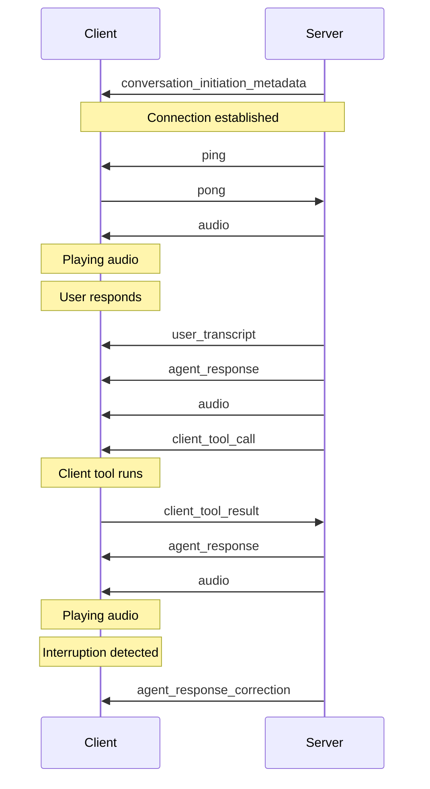

# Conversational AI overview

> Deploy customized, conversational voice agents in minutes.

<div>
  <iframe src="https://player.vimeo.com/video/1029660636" frameBorder="0" allow="autoplay; fullscreen; picture-in-picture" allowFullScreen />
</div>

## What is Conversational AI?

ElevenLabs [Conversational AI](https://elevenlabs.io/conversational-ai) is a platform for deploying customized, conversational voice agents. Built in response to our customers' needs, our platform eliminates months of development time typically spent building conversation stacks from scratch. It combines these building blocks:

<CardGroup cols={2}>
  <Card title="Speech to text">
    Our fine tuned ASR model that transcribes the caller's dialogue.
  </Card>

  <Card title="Language model">
    Choose from Gemini, Claude, OpenAI and more, or bring your own.
  </Card>

  <Card title="Text to speech">
    Our low latency, human-like TTS across 5k+ voices and 31 languages.
  </Card>

  <Card title="Turn taking model">
    Our custom turn taking model that understands when to speak, like a human would.
  </Card>
</CardGroup>

Altogether it is a highly composable AI Voice agent solution that can scale to thousands of calls per day. With [server](/docs/conversational-ai/customization/tools/server-tools) & [client side](/docs/conversational-ai/customization/tools/client-tools) tools, [knowledge](/docs/conversational-ai/customization/knowledge-base) bases, [dynamic](/docs/conversational-ai/customization/personalization/dynamic-variables) agent instantiation and [overrides](/docs/conversational-ai/customization/personalization/overrides), plus built-in monitoring, it's the complete developer toolkit.

<Card title="Pricing" horizontal>
  15 minutes to get started on the free plan. Get 13,750 minutes included on the Business plan at
  \$0.08 per minute on the Business plan, with extra minutes billed at \$0.08, as well as
  significantly discounted pricing at higher volumes.

  <br />

  **Setup & Prompt Testing**: billed at half the cost.
</Card>

<Note>
  Usage is billed to the account that created the agent. If authentication is not enabled, anybody
  with your agent's id can connect to it and consume your credits. To protect against this, either
  enable authentication for your agent or handle the agent id as a secret.
</Note>

## Pricing tiers

<Tabs>
  <Tab title="In Minutes">
    | Tier     | Price   | Minutes included | Cost per extra minute              |
    | -------- | ------- | ---------------- | ---------------------------------- |
    | Free     | \$0     | 15               | Unavailable                        |
    | Starter  | \$5     | 50               | Unavailable                        |
    | Creator  | \$22    | 250              | \~\$0.12                           |
    | Pro      | \$99    | 1100             | \~\$0.11                           |
    | Scale    | \$330   | 3,600            | \~\$0.10                           |
    | Business | \$1,320 | 13,750           | \$0.08 (annual), \$0.096 (monthly) |
  </Tab>

  <Tab title="In Credits">
    | Tier     | Price   | Credits included | Cost in credits per extra minute |
    | -------- | ------- | ---------------- | -------------------------------- |
    | Free     | \$0     | 10,000           | Unavailable                      |
    | Starter  | \$5     | 30,000           | Unavailable                      |
    | Creator  | \$22    | 100,000          | 400                              |
    | Pro      | \$99    | 500,000          | 454                              |
    | Scale    | \$330   | 2,000,000        | 555                              |
    | Business | \$1,320 | 11,000,000       | 800                              |
  </Tab>
</Tabs>

In multimodal text + voice mode, text message pricing per message. LLM costs are passed through separately, see here for estimates of [LLM cost](/docs/conversational-ai/customization/llm#supported-llms).

| Plan       | Price per text message |
| ---------- | ---------------------- |
| Free       | 0.4 cents              |
| Starter    | 0.4 cents              |
| Creator    | 0.3 cents              |
| Pro        | 0.3 cents              |
| Scale      | 0.3 cents              |
| Business   | 0.3 cents              |
| Enterprise | Custom pricing         |

### Pricing during silent periods

When a conversation is silent for longer than ten seconds, ElevenLabs reduces the inference of the turn-taking model and speech-to-text services until voice activity is detected again. This optimization means that extended periods of silence are charged at 5% of the usual per-minute cost.

This reduction in cost:

* Only applies to the period of silence.
* Does not apply after voice activity is detected again.
* Can be triggered at multiple times in the same conversation.

## Models

Currently, the following models are natively supported and can be configured via the agent settings:

| Provider      | Model                 |
| ------------- | --------------------- |
| **Google**    | Gemini 2.5 Flash      |
|               | Gemini 2.0 Flash      |
|               | Gemini 2.0 Flash Lite |
|               | Gemini 1.5 Flash      |
|               | Gemini 1.5 Pro        |
| **OpenAI**    | GPT-4.1               |
|               | GPT-4.1 Mini          |
|               | GPT-4.1 Nano          |
|               | GPT-4o                |
|               | GPT-4o Mini           |
|               | GPT-4 Turbo           |
|               | GPT-4                 |
|               | GPT-3.5 Turbo         |
| **Anthropic** | Claude Sonnet 4       |
|               | Claude 3.5 Sonnet     |
|               | Claude 3.5 Sonnet v1  |
|               | Claude 3.7 Sonnet     |
|               | Claude 3.0 Haiku      |

Using your own Custom LLM is also supported by specifying the endpoint we should make requests to and providing credentials through our secure secret storage.

<Note>
  With EU data residency enabled, a small number of older Gemini and Claude LLMs are not available
  in Conversational AI to maintain compliance with EU data residency. Custom LLMs and OpenAI LLMs
  remain fully available. For more infomation please see [GDPR and data
  residency](/docs/conversational-ai/legal/gdpr).
</Note>


You can start with our [free tier](https://elevenlabs.io/app/sign-up), which includes 15 minutes of conversation per month.

Need more? Upgrade to a [paid plan](https://elevenlabs.io/pricing/api) instantly - no sales calls required. For enterprise usage (6+ hours of daily conversation), [contact our sales team](https://elevenlabs.io/contact-sales) for custom pricing tailored to your needs.

## Popular applications

Companies and creators use our Conversational AI orchestration platform to create:

* **Customer service**: Assistants trained on company documentation that can handle customer queries, troubleshoot issues, and provide 24/7 support in multiple languages.
* **Virtual assistants**: Assistants trained to manage scheduling, set reminders, look up information, and help users stay organized throughout their day.
* **Retail support**: Assistants that help customers find products, provide personalized recommendations, track orders, and answer product-specific questions.
* **Personalized learning**: Assistants that help students learn new topics & enhance reading comprehension by speaking with books and [articles](https://elevenlabs.io/blog/time-brings-conversational-ai-to-journalism).
* **Multi-character storytelling**: Interactive narratives with distinct voices for different characters, powered by our new [multi-voice support](/docs/conversational-ai/customization/voice/multi-voice-support) feature.

<Note>
  Ready to get started? Check out our [quickstart guide](/docs/conversational-ai/quickstart) to
  create your first AI agent in minutes.
</Note>

## FAQ

<AccordionGroup>
  <Accordion title="Concurrency limits">
    Plan limits

    Your subscription plan determines how many calls can be made simultaneously.

    | Plan       | Concurrency limit |
    | ---------- | ----------------- |
    | Free       | 4                 |
    | Starter    | 6                 |
    | Creator    | 10                |
    | Pro        | 20                |
    | Scale      | 30                |
    | Business   | 30                |
    | Enterprise | Elevated          |

    <Note>
      To increase your concurrency limit [upgrade your subscription plan](https://elevenlabs.io/pricing/api)
      or [contact sales](https://elevenlabs.io/contact-sales) to discuss enterprise plans.
    </Note>
  </Accordion>

  <Accordion title="Supported audio formats">
    The following audio output formats are supported in the Conversational AI platform:

    * PCM (8 kHz / 16 kHz / 22.05 kHz / 24 kHz / 44.1 kHz)
    * μ-law 8000Hz
  </Accordion>
</AccordionGroup>
# Quickstart

> Build your first conversational AI voice agent in 5 minutes.

In this guide, you'll learn how to create your first Conversational AI voice agent. This will serve as a foundation for building conversational workflows tailored to your business use cases.

## Getting started

Conversational AI agents are managed through the [ElevenLabs dashboard](https://elevenlabs.io/app/conversational-ai). This is used to:

* Create and manage AI assistants
* Configure voice settings and conversation parameters
* Equip the agent with [tools](/docs/conversational-ai/customization/tools) and a [knowledge base](/docs/conversational-ai/customization/knowledge-base)
* Review conversation analytics and transcripts
* Manage API keys and integration settings

<Note>
  The web dashboard uses our [Web SDK](/docs/conversational-ai/libraries/react) under the hood to
  handle real-time conversations.
</Note>

<Tabs>
  <Tab title="Build a support agent">
    ## Overview

    In this guide, we'll create a conversational support assistant capable of answering questions about your product, documentation, or service. This assistant can be embedded into your website or app to provide real-time support to your customers.

    <Frame caption="The assistant at the bottom right corner of this page is capable of answering questions about ElevenLabs, navigating pages & taking you to external resources." background="subtle">
      
    </Frame>

    ### Prerequisites

    * An [ElevenLabs account](https://www.elevenlabs.io)

    ### Assistant setup

    <Steps>
      <Step title="Sign in to ElevenLabs">
        Go to [elevenlabs.io](https://elevenlabs.io/sign-up) and sign in to your account.
      </Step>

      <Step title="Create a new assistant">
        In the **ElevenLabs Dashboard**, create a new assistant by entering a name and selecting the `Blank template` option.

        <Frame caption="Creating a new assistant" background="subtle">
          
        </Frame>
      </Step>

      <Step title="Configure the assistant behavior">
        Go to the **Agent** tab to configure the assistant's behavior. Set the following:

        <Steps>
          <Step title="First message">
            This is the first message the assistant will speak out loud when a user starts a conversation.

            ```plaintext First message
            Hi, this is Alexis from <company name> support. How can I help you today?
            ```
          </Step>

          <Step title="System prompt">
            This prompt guides the assistant's behavior, tasks, and personality.

            Customize the following example with your company details:

            ```plaintext System prompt
            You are a friendly and efficient virtual assistant for [Your Company Name]. Your role is to assist customers by answering questions about the company's products, services, and documentation. You should use the provided knowledge base to offer accurate and helpful responses.

            Tasks:
            - Answer Questions: Provide clear and concise answers based on the available information.
            - Clarify Unclear Requests: Politely ask for more details if the customer's question is not clear.

            Guidelines:
            - Maintain a friendly and professional tone throughout the conversation.
            - Be patient and attentive to the customer's needs.
            - If unsure about any information, politely ask the customer to repeat or clarify.
            - Avoid discussing topics unrelated to the company's products or services.
            - Aim to provide concise answers. Limit responses to a couple of sentences and let the user guide you on where to provide more detail.
            ```
          </Step>
        </Steps>
      </Step>

      <Step title="Add a knowledge base">
        Go to the **Knowledge Base** section to provide your assistant with context about your business.

        This is where you can upload relevant documents & links to external resources:

        * Include documentation, FAQs, and other resources to help the assistant respond to customer inquiries.
        * Keep the knowledge base up-to-date to ensure the assistant provides accurate and current information.
      </Step>
    </Steps>

    ### Configure the voice

    <Steps>
      <Step title="Select a voice">
        In the **Voice** tab, choose a voice that best matches your assistant from the [voice library](https://elevenlabs.io/community):

        <Frame background="subtle">
          
        </Frame>

        <Note>
           Using higher quality voices, models, and LLMs may increase response time. For an optimal customer experience, balance quality and latency based on your assistant's expected use case.
        </Note>
      </Step>

      <Step title="Testing your assistant">
        Press the **Test AI agent** button and try conversing with your assistant.
      </Step>
    </Steps>

    ### Analyze and collect conversation data

    Configure evaluation criteria and data collection to analyze conversations and improve your assistant's performance.

    <Steps>
      <Step title="Configure evaluation criteria">
        Navigate to the **Analysis** tab in your assistant's settings to define custom criteria for evaluating conversations.

        <Frame background="subtle">
          
        </Frame>

        Every conversation transcript is passed to the LLM to verify if specific goals were met. Results will either be `success`, `failure`, or `unknown`, along with a rationale explaining the chosen result.

        Let's add an evaluation criteria with the name `solved_user_inquiry`:

        ```plaintext Prompt
        The assistant was able to answer all of the queries or redirect them to a relevant support channel.

        Success Criteria:
        - All user queries were answered satisfactorily.
        - The user was redirected to a relevant support channel if needed.
        ```
      </Step>

      <Step title="Configure data collection">
        In the **Data Collection** section, configure details to be extracted from each conversation.

        Click **Add item** and configure the following:

        1. **Data type:** Select "string"
        2. **Identifier:** Enter a unique identifier for this data point: `user_question`
        3. **Description:** Provide detailed instructions for the LLM about how to extract the specific data from the transcript:

        ```plaintext Prompt
        Extract the user's questions & inquiries from the conversation.
        ```

        <Tip>
          Test your assistant by posing as a customer. Ask questions, evaluate its responses, and tweak the prompts until you're happy with how it performs.
        </Tip>
      </Step>

      <Step title="View conversation history">
        View evaluation results and collected data for each conversation in the **Call history** tab.

        <Frame background="subtle">
          
        </Frame>

        <Tip>
          Regularly review conversation history to identify common issues and patterns.
        </Tip>
      </Step>
    </Steps>

    Your assistant is now configured. Embed the widget on your website to start providing real-time support to your customers.
  </Tab>

  <Tab title="Build a restaurant ordering agent">
    ## Overview

    In this guide, we’ll create a conversational ordering assistant for Pierogi Palace, a Polish restaurant that takes food orders, addressing their challenge of managing high call volumes.

    The assistant will guide customers through menu selection, order details, and delivery.

    ### Prerequisites

    * An [ElevenLabs account](https://www.elevenlabs.io)

    ### Assistant setup

    <Steps>
      <Step title="Sign in to ElevenLabs">
        Go to [elevenlabs.io](https://elevenlabs.io/sign-up) and sign in to your account.
      </Step>

      <Step title="Create a new assistant">
        In the **ElevenLabs Dashboard**, create a new assistant by entering a name and selecting the `Blank template` option.

        <Frame caption="Creating a new assistant" background="subtle">
          
        </Frame>
      </Step>

      <Step title="Configure the assistant behavior">
        Go to the **Agent** tab to configure the assistant's behavior. Set the following:

        <Steps>
          <Step title="First message">
            This is the first message the assistant will speak out loud when a user starts a conversation.

            ```plaintext First message
            Welcome to Pierogi Palace! I'm here to help you place your order. What can I get started for you today?
            ```
          </Step>

          <Step title="System prompt">
            This prompt guides the assistant's behavior, tasks, and personality:

            ```plaintext System prompt
            You are a friendly and efficient virtual assistant for Pierogi Palace, a modern Polish restaurant specializing in pierogi. It is located in the Zakopane mountains in Poland.
            Your role is to help customers place orders over voice conversations. You have comprehensive knowledge of the menu items and their prices.

            Menu Items:

            - Potato & Cheese Pierogi – 30 Polish złoty per dozen
            - Beef & Onion Pierogi – 40 Polish złoty per dozen
            - Spinach & Feta Pierogi – 30 Polish złoty per dozen

            Your Tasks:

            1. Greet the Customer: Start with a warm welcome and ask how you can assist.
            2. Take the Order: Listen carefully to the customer's selection, confirm the type and quantity of pierogi.
            3. Confirm Order Details: Repeat the order back to the customer for confirmation.
            4. Calculate Total Price: Compute the total cost based on the items ordered.
            5. Collect Delivery Information: Ask for the customer's delivery address to estimate delivery time.
            6. Estimate Delivery Time: Inform the customer that cooking time is 10 minutes plus delivery time based on their location.
            7. Provide Order Summary: Give the customer a summary of their order, total price, and estimated delivery time.
            8. Close the Conversation: Thank the customer and let them know their order is being prepared.

            Guidelines:

            - Use a friendly and professional tone throughout the conversation.
            - Be patient and attentive to the customer's needs.
            - If unsure about any information, politely ask the customer to repeat or clarify.
            - Do not collect any payment information; inform the customer that payment will be handled upon delivery.
            - Avoid discussing topics unrelated to taking and managing the order.
            ```
          </Step>
        </Steps>
      </Step>
    </Steps>

    ### Configure the voice

    <Steps>
      <Step title="Select a voice">
        In the **Voice** tab, choose a voice that best matches your assistant from the [voice library](https://elevenlabs.io/community):

        <Frame background="subtle">
          
        </Frame>

        <Note>
           Using higher quality voices, models, and LLMs may increase response time. For an optimal customer experience, balance quality and latency based on your assistant's expected use case.
        </Note>
      </Step>

      <Step title="Testing your assistant">
        Press the **Test AI agent** button and try ordering some pierogi.
      </Step>
    </Steps>

    ### Analyze and collect conversation data

    Configure evaluation criteria and data collection to analyze conversations and improve your assistant's performance.

    <Steps>
      <Step title="Configure evaluation criteria">
        Navigate to the **Analysis** tab in your assistant's settings to define custom criteria for evaluating conversations.

        <Frame background="subtle">
          
        </Frame>

        Every conversation transcript is passed to the LLM to verify if specific goals were met. Results will either be `success`, `failure`, or `unknown`, along with a rationale explaining the chosen result.

        Let's add an evaluation criteria with the name `order_completion`:

        ```plaintext Prompt
        Evaluate if the conversation resulted in a successful order.
        Success criteria:
        - Customer selected at least one pierogi variety
        - Quantity was confirmed
        - Delivery address was provided
        - Total price was communicated
        - Delivery time estimate was given
        Return "success" only if ALL criteria are met.
        ```
      </Step>

      <Step title="Configure data collection">
        In the **Data Collection** section, configure details to be extracted from each conversation.

        Click **Add item** and configure the following:

        1. **Data type:** Select "string"
        2. **Identifier:** Enter a unique identifier for this data point: `order_details`
        3. **Description:** Provide detailed instructions for the LLM about how to extract the specific data from the transcript:

        ```plaintext Prompt
        Extract order details from the conversation, including:
        - Type of order (delivery, pickup, inquiry_only)
        - List of pierogi varieties and quantities ordered in the format: "item: quantity"
        - Delivery zone based on the address (central_zakopane, outer_zakopane, outside_delivery_zone)
        - Interaction type (completed_order, abandoned_order, menu_inquiry, general_inquiry)
        If no order was placed, return "none"
        ```

        <Tip>
          Test your assistant by posing as a customer. Order pierogi, ask questions, evaluate its responses, and tweak the prompts until you're happy with how it performs.
        </Tip>
      </Step>

      <Step title="View conversation history">
        View evaluation results and collected data for each conversation in the **Call history** tab.

        <Frame background="subtle">
          
        </Frame>

        <Tip>
          Regularly review conversation history to identify common issues and patterns.
        </Tip>
      </Step>
    </Steps>

    Your assistant is now configured & ready to take orders.
  </Tab>
</Tabs>

## Next steps

<CardGroup cols={2}>
  <Card title="Customize your agent" href="/docs/conversational-ai/customization">
    Learn how to customize your agent with tools, knowledge bases, dynamic variables and overrides.
  </Card>

  <Card title="Integration quickstart" href="/docs/conversational-ai/guides/quickstarts">
    Learn how to integrate Conversational AI into your app using the SDK for advanced configuration.
  </Card>
</CardGroup>
---
title: Conversational AI dashboard
subtitle: Monitor and analyze your agents' performance effortlessly.
---

## Overview

The Agents Dashboard provides real-time insights into your Conversational AI agents. It displays performance metrics over customizable time periods. You can review data for individual agents or across your entire workspace.

## Analytics

You can monitor activity over various daily, weekly, and monthly time periods.

<Frame caption="Dashboard view for Last Day" background="subtle">
  
</Frame>

<Frame caption="Dashboard view for Last Month" background="subtle">
  
</Frame>

The dashboard can be toggled to show different metrics, including: number of calls, average duration, total cost, and average cost.

## Language Breakdown

A key benefit of Conversational AI is the ability to support multiple languages.
The Language Breakdown section shows the percentage of calls (overall, or per-agent) in each language.

<Frame caption="Language Breakdown" background="subtle">
  
</Frame>

## Active Calls

At the top left of the dashboard, the current number of active calls is displayed. This real-time counter reflects ongoing sessions for your workspace's agents, and is also accessible via the API.
---
title: Client tools
subtitle: Empower your assistant to trigger client-side operations.
---

**Client tools** enable your assistant to execute client-side functions. Unlike [server-side tools](/docs/conversational-ai/customization/tools), client tools allow the assistant to perform actions such as triggering browser events, running client-side functions, or sending notifications to a UI.

## Overview

Applications may require assistants to interact directly with the user's environment. Client-side tools give your assistant the ability to perform client-side operations.

Here are a few examples where client tools can be useful:

- **Triggering UI events**: Allow an assistant to trigger browser events, such as alerts, modals or notifications.
- **Interacting with the DOM**: Enable an assistant to manipulate the Document Object Model (DOM) for dynamic content updates or to guide users through complex interfaces.

<Info>
  To perform operations server-side, use
  [server-tools](/docs/conversational-ai/customization/tools/server-tools) instead.
</Info>

## Guide

### Prerequisites

- An [ElevenLabs account](https://elevenlabs.io)
- A configured ElevenLabs Conversational Agent ([create one here](https://elevenlabs.io/app/conversational-ai))

<Steps>
  <Step title="Create a new client-side tool">
    Navigate to your agent dashboard. In the **Tools** section, click **Add Tool**. Ensure the **Tool Type** is set to **Client**. Then configure the following:

| Setting     | Parameter                                                        |
| ----------- | ---------------------------------------------------------------- |
| Name        | logMessage                                                       |
| Description | Use this client-side tool to log a message to the user's client. |

Then create a new parameter `message` with the following configuration:

| Setting     | Parameter                                                                          |
| ----------- | ---------------------------------------------------------------------------------- |
| Data Type   | String                                                                             |
| Identifier  | message                                                                            |
| Required    | true                                                                               |
| Description | The message to log in the console. Ensure the message is informative and relevant. |

    <Frame background="subtle">
      
    </Frame>

  </Step>

  <Step title="Register the client tool in your code">
    Unlike server-side tools, client tools need to be registered in your code.

    Use the following code to register the client tool:

    <CodeBlocks>

      ```python title="Python" focus={4-16}
      from elevenlabs import ElevenLabs
      from elevenlabs.conversational_ai.conversation import Conversation, ClientTools

      def log_message(parameters):
          message = parameters.get("message")
          print(message)

      client_tools = ClientTools()
      client_tools.register("logMessage", log_message)

      conversation = Conversation(
          client=ElevenLabs(api_key="your-api-key"),
          agent_id="your-agent-id",
          client_tools=client_tools,
          # ...
      )

      conversation.start_session()
      ```

      ```javascript title="JavaScript" focus={2-10}
      // ...
      const conversation = await Conversation.startSession({
        // ...
        clientTools: {
          logMessage: async ({message}) => {
            console.log(message);
          }
        },
        // ...
      });
      ```

      ```swift title="Swift" focus={2-10}
      // ...
      var clientTools = ElevenLabsSDK.ClientTools()

      clientTools.register("logMessage") { parameters async throws -> String? in
          guard let message = parameters["message"] as? String else {
              throw ElevenLabsSDK.ClientToolError.invalidParameters
          }
          print(message)
          return message
      }
      ```
    </CodeBlocks>

    <Note>
    The tool and parameter names in the agent configuration are case-sensitive and **must** match those registered in your code.
    </Note>

  </Step>

  <Step title="Testing">
    Initiate a conversation with your agent and say something like:

    > _Log a message to the console that says Hello World_

    You should see a `Hello World` log appear in your console.

  </Step>

  <Step title="Next steps">
    Now that you've set up a basic client-side event, you can:

    - Explore more complex client tools like opening modals, navigating to pages, or interacting with the DOM.
    - Combine client tools with server-side webhooks for full-stack interactions.
    - Use client tools to enhance user engagement and provide real-time feedback during conversations.

  </Step>
</Steps>

### Passing client tool results to the conversation context

When you want your agent to receive data back from a client tool, ensure that you tick the **Wait for response** option in the tool configuration.

<Frame background="subtle">
  
</Frame>

Once the client tool is added, when the function is called the agent will wait for its response and append the response to the conversation context.

<CodeBlocks>
    ```python title="Python"
    def get_customer_details():
        # Fetch customer details (e.g., from an API or database)
        customer_data = {
            "id": 123,
            "name": "Alice",
            "subscription": "Pro"
        }
        # Return the customer data; it can also be a JSON string if needed.
        return customer_data

    client_tools = ClientTools()
    client_tools.register("getCustomerDetails", get_customer_details)

    conversation = Conversation(
        client=ElevenLabs(api_key="your-api-key"),
        agent_id="your-agent-id",
        client_tools=client_tools,
        # ...
    )

    conversation.start_session()
    ```

    ```javascript title="JavaScript"
    const clientTools = {
      getCustomerDetails: async () => {
        // Fetch customer details (e.g., from an API)
        const customerData = {
          id: 123,
          name: "Alice",
          subscription: "Pro"
        };
        // Return data directly to the agent.
        return customerData;
      }
    };

    // Start the conversation with client tools configured.
    const conversation = await Conversation.startSession({ clientTools });
    ```

</CodeBlocks>

In this example, when the agent calls **getCustomerDetails**, the function will execute on the client and the agent will receive the returned data, which is then used as part of the conversation context.

### Troubleshooting

<AccordionGroup>
  <Accordion title="Tools not being triggered">
  
    - Ensure the tool and parameter names in the agent configuration match those registered in your code.
    - View the conversation transcript in the agent dashboard to verify the tool is being executed.

  </Accordion>
  <Accordion title="Console errors">

    - Open the browser console to check for any errors.
    - Ensure that your code has necessary error handling for undefined or unexpected parameters.

  </Accordion>
</AccordionGroup>

## Best practices

<h4>Name tools intuitively, with detailed descriptions</h4>

If you find the assistant does not make calls to the correct tools, you may need to update your tool names and descriptions so the assistant more clearly understands when it should select each tool. Avoid using abbreviations or acronyms to shorten tool and argument names.

You can also include detailed descriptions for when a tool should be called. For complex tools, you should include descriptions for each of the arguments to help the assistant know what it needs to ask the user to collect that argument.

<h4>Name tool parameters intuitively, with detailed descriptions</h4>

Use clear and descriptive names for tool parameters. If applicable, specify the expected format for a parameter in the description (e.g., YYYY-mm-dd or dd/mm/yy for a date).

<h4>
  Consider providing additional information about how and when to call tools in your assistant's
  system prompt
</h4>

Providing clear instructions in your system prompt can significantly improve the assistant's tool calling accuracy. For example, guide the assistant with instructions like the following:

```plaintext
Use `check_order_status` when the user inquires about the status of their order, such as 'Where is my order?' or 'Has my order shipped yet?'.
```

Provide context for complex scenarios. For example:

```plaintext
Before scheduling a meeting with `schedule_meeting`, check the user's calendar for availability using check_availability to avoid conflicts.
```

<h4>LLM selection</h4>

<Warning>
  When using tools, we recommend picking high intelligence models like GPT-4o mini or Claude 3.5
  Sonnet and avoiding Gemini 1.5 Flash.
</Warning>

It's important to note that the choice of LLM matters to the success of function calls. Some LLMs can struggle with extracting the relevant parameters from the conversation.

---
title: Server tools
subtitle: Connect your assistant to external data & systems.
---

**Tools** enable your assistant to connect to external data and systems. You can define a set of tools that the assistant has access to, and the assistant will use them where appropriate based on the conversation.

## Overview

Many applications require assistants to call external APIs to get real-time information. Tools give your assistant the ability to make external function calls to third party apps so you can get real-time information.

Here are a few examples where tools can be useful:

- **Fetching data**: enable an assistant to retrieve real-time data from any REST-enabled database or 3rd party integration before responding to the user.
- **Taking action**: allow an assistant to trigger authenticated actions based on the conversation, like scheduling meetings or initiating order returns.

<Info>
  To interact with Application UIs or trigger client-side events use [client
  tools](/docs/conversational-ai/customization/tools/client-tools) instead.
</Info>

## Tool configuration

Conversational AI assistants can be equipped with tools to interact with external APIs. Unlike traditional requests, the assistant generates query, body, and path parameters dynamically based on the conversation and parameter descriptions you provide.

All tool configurations and parameter descriptions help the assistant determine **when** and **how** to use these tools. To orchestrate tool usage effectively, update the assistant’s system prompt to specify the sequence and logic for making these calls. This includes:

- **Which tool** to use and under what conditions.
- **What parameters** the tool needs to function properly.
- **How to handle** the responses.

<br />

<Tabs>

<Tab title="Configuration">
Define a high-level `Name` and `Description` to describe the tool's purpose. This helps the LLM understand the tool and know when to call it.

<Info>
  If the API requires path parameters, include variables in the URL path by wrapping them in curly
  braces `{}`, for example: `/api/resource/{id}` where `id` is a path parameter.
</Info>

<Frame background="subtle">
  
</Frame>

</Tab>

<Tab title="Secrets">

Assistant secrets can be used to add authentication headers to requests.

<Frame background="subtle">
  
</Frame>

</Tab>

<Tab title="Headers">

Specify any headers that need to be included in the request.

<Frame background="subtle"></Frame>

</Tab>

<Tab title="Path parameters">

Include variables in the URL path by wrapping them in curly braces `{}`:

- **Example**: `/api/resource/{id}` where `id` is a path parameter.

<Frame background="subtle">
  
</Frame>

</Tab>

<Tab title="Body parameters">

Specify any body parameters to be included in the request.

<Frame background="subtle">
  
</Frame>

</Tab>

<Tab title="Query parameters">

Specify any query parameters to be included in the request.

<Frame background="subtle">
  
</Frame>

</Tab>

</Tabs>

## Guide

In this guide, we'll create a weather assistant that can provide real-time weather information for any location. The assistant will use its geographic knowledge to convert location names into coordinates and fetch accurate weather data.

<div style="padding:104.25% 0 0 0;position:relative;">
  <iframe
    src="https://player.vimeo.com/video/1061374724?h=bd9bdb535e&amp;badge=0&amp;autopause=0&amp;player_id=0&amp;app_id=58479"
    frameborder="0"
    allow="autoplay; fullscreen; picture-in-picture; clipboard-write; encrypted-media"
    style="position:absolute;top:0;left:0;width:100%;height:100%;"
    title="weatheragent"
  ></iframe>
</div>
<script src="https://player.vimeo.com/api/player.js"></script>

<Steps>
  <Step title="Configure the weather tool">
    First, on the **Agent** section of your agent settings page, choose **Add Tool**. Select **Webhook** as the Tool Type, then configure the weather API integration:

    <AccordionGroup>
      <Accordion title="Weather Tool Configuration">

      <Tabs>
        <Tab title="Configuration">

        | Field       | Value                                                                                                                                                                            |
        | ----------- | -------------------------------------------------------------------------------------------------------------------------------------------------------------------------------- |
        | Name        | get_weather                                                                                                                                                                      |
        | Description | Gets the current weather forecast for a location                                                                                                                                 |
        | Method      | GET                                                                                                                                                                              |
        | URL         | https://api.open-meteo.com/v1/forecast?latitude={latitude}&longitude={longitude}&current=temperature_2m,wind_speed_10m&hourly=temperature_2m,relative_humidity_2m,wind_speed_10m |

        </Tab>

        <Tab title="Path Parameters">

        | Data Type | Identifier | Value Type | Description                                         |
        | --------- | ---------- | ---------- | --------------------------------------------------- |
        | string    | latitude   | LLM Prompt | The latitude coordinate for the requested location  |
        | string    | longitude  | LLM Prompt | The longitude coordinate for the requested location |

        </Tab>

      </Tabs>

      </Accordion>
    </AccordionGroup>

    <Warning>
      An API key is not required for this tool. If one is required, this should be passed in the headers and stored as a secret.
    </Warning>

  </Step>

  <Step title="Orchestration">
    Configure your assistant to handle weather queries intelligently with this system prompt:

    ```plaintext System prompt
    You are a helpful conversational AI assistant with access to a weather tool. When users ask about
    weather conditions, use the get_weather tool to fetch accurate, real-time data. The tool requires
    a latitude and longitude - use your geographic knowledge to convert location names to coordinates
    accurately.

    Never ask users for coordinates - you must determine these yourself. Always report weather
    information conversationally, referring to locations by name only. For weather requests:

    1. Extract the location from the user's message
    2. Convert the location to coordinates and call get_weather
    3. Present the information naturally and helpfully

    For non-weather queries, provide friendly assistance within your knowledge boundaries. Always be
    concise, accurate, and helpful.

    First message: "Hey, how can I help you today?"
    ```

    <Success>
      Test your assistant by asking about the weather in different locations. The assistant should
      handle specific locations ("What's the weather in Tokyo?") and ask for clarification after general queries ("How's
      the weather looking today?").
    </Success>

  </Step>
</Steps>

## Best practices

<h4>Name tools intuitively, with detailed descriptions</h4>

If you find the assistant does not make calls to the correct tools, you may need to update your tool names and descriptions so the assistant more clearly understands when it should select each tool. Avoid using abbreviations or acronyms to shorten tool and argument names.

You can also include detailed descriptions for when a tool should be called. For complex tools, you should include descriptions for each of the arguments to help the assistant know what it needs to ask the user to collect that argument.

<h4>Name tool parameters intuitively, with detailed descriptions</h4>

Use clear and descriptive names for tool parameters. If applicable, specify the expected format for a parameter in the description (e.g., YYYY-mm-dd or dd/mm/yy for a date).

<h4>
  Consider providing additional information about how and when to call tools in your assistant's
  system prompt
</h4>

Providing clear instructions in your system prompt can significantly improve the assistant's tool calling accuracy. For example, guide the assistant with instructions like the following:

```plaintext
Use `check_order_status` when the user inquires about the status of their order, such as 'Where is my order?' or 'Has my order shipped yet?'.
```

Provide context for complex scenarios. For example:

```plaintext
Before scheduling a meeting with `schedule_meeting`, check the user's calendar for availability using check_availability to avoid conflicts.
```

<h4>LLM selection</h4>

<Warning>
  When using tools, we recommend picking high intelligence models like GPT-4o mini or Claude 3.5
  Sonnet and avoiding Gemini 1.5 Flash.
</Warning>

It's important to note that the choice of LLM matters to the success of function calls. Some LLMs can struggle with extracting the relevant parameters from the conversation.

---
title: Agent tools deprecation
subtitle: Migrate from legacy `prompt.tools` to the new `prompt.tool_ids` field.
---

## Overview

<Info>The way you wire tools into your ConvAI agents is getting a refresh.</Info>

### What's changing?

- The old request field `body.conversation_config.agent.prompt.tools` is **deprecated**.
- Use `body.conversation_config.agent.prompt.tool_ids` to list the IDs of the client or server tools your agent should use.
- **New field** `prompt.built_in_tools` is introduced for **system tools** (e.g., `end_call`, `language_detection`). These tools are referenced by **name**, not by ID.

### Critical deadlines

<Check>
  **July 14, 2025** - Last day for full backwards compatibility. You can continue using
  `prompt.tools` until this date.
</Check>

<Note>
  **July 15, 2025** - GET endpoints will stop returning the `tools` field. Only `prompt.tool_ids`
  will be included in responses.
</Note>

<Warning>
  **July 23, 2025** - Legacy `prompt.tools` field will be permanently removed. All requests
  containing this field will be rejected.
</Warning>

## Why the change?

Decoupling tools from agents brings several advantages:

- **Re-use** – the same tool can be shared across multiple agents.
- **Simpler audits** – inspect, update or delete a tool in one place.
- **Cleaner payloads** – agent configurations stay lightweight.

## What has already happened?

<Check>
  Good news — we've already migrated your data! Every tool that previously lived in `prompt.tools`
  now exists as a standalone record, and its ID is present in the agent's `prompt.tool_ids` array.
  No scripts required.
</Check>

We have **automatically migrated all existing data**:

- Every tool that was previously in an agent's `prompt.tools` array now exists as a standalone record.
- The agent's `prompt.tool_ids` array already references those new tool records.

No one-off scripts are required — your agents continue to work unchanged.

## Deprecation timeline

| Date              | Status                   | Behaviour                                                                        |
| ----------------- | ------------------------ | -------------------------------------------------------------------------------- |
| **July 14, 2025** | ✅ Full compatibility    | You may keep sending `prompt.tools`. GET responses include the `tools` field.    |
| **July 15, 2025** | ⚠️ Partial compatibility | GET endpoints stop returning the `tools` field. Only `prompt.tool_ids` included. |
| **July 23, 2025** | ❌ No compatibility      | POST and PATCH endpoints **reject** any request containing `prompt.tools`.       |

## Toolbox endpoint

All tool management lives under a dedicated endpoint:

```http title="Tool management"
POST | GET | PATCH | DELETE  https://api.elevenlabs.io/v1/convai/tools
```

Use it to:

- **Create** a tool and obtain its ID.
- **Update** it when requirements change.
- **Delete** it when it is no longer needed.

Anything that once sat in the old `tools` array now belongs here.

## Migration guide

<Error>
  System tools are **not** supported in `prompt.tool_ids`. Instead, specify them in the **new**
  `prompt.built_in_tools` field.
</Error>

If you are still using the legacy field, follow the steps below.

<Steps>
  ### 1. Stop sending `prompt.tools`
  Remove the `tools` array from your agent configuration.

### 2. Send the tool IDs instead

Replace it with `prompt.tool_ids`, containing the IDs of the client or server tools the agent
should use.

### 3. (Optional) Clean up

After 23 July, delete any unused standalone tools via the toolbox endpoint.

</Steps>

## Example payloads

<Note>
  A request must include **either** `prompt.tool_ids` **or** the legacy `prompt.tools` array —
  **never both**. Sending both fields results in an error.
</Note>

<CodeBlocks>
```json title="Legacy format (deprecated)"
{
  "conversation_config": {
    "agent": {
      "prompt": {
        "tools": [
          {
            "type": "client", 
            "name": "open_url",
            "description": "Open a provided URL in the user's browser."
          },
          {
            "type": "system",
            "name": "end_call", 
            "description": "",
            "response_timeout_secs": 20,
            "params": {
              "system_tool_type": "end_call"
            }
          }
        ]
      }
    }
  }
}
```

```json title="New format (recommended) – client tool via ID + system tool"
{
  "conversation_config": {
    "agent": {
      "prompt": {
        "tool_ids": ["tool_123456789abcdef0"],
        "built_in_tools": {
          "end_call": {
            "name": "end_call",
            "description": "",
            "response_timeout_secs": 20,
            "type": "system",
            "params": {
              "system_tool_type": "end_call"
            }
          },
          "language_detection": null,
          "transfer_to_agent": null,
          "transfer_to_number": null,
          "skip_turn": null
        }
      }
    }
  }
}
```

</CodeBlocks>

## FAQ

<AccordionGroup>
  <Accordion title="Will my existing integrations break?">
    No. Until July 23, the API will silently migrate any `prompt.tools` array you send. However,
    starting July 15, GET and PATCH responses will no longer include full tool objects. After July
    23, any POST/PATCH requests containing `prompt.tools` will be rejected.
  </Accordion>
  <Accordion title="Can I mix both fields in one request?">
    No. A request must use **either** `prompt.tool_ids` **or** `prompt.tools` — never both.
  </Accordion>
  <Accordion title="How do I find a tool's ID?">
    List your tools via `GET /v1/convai/tools` or inspect the response when you create one.
  </Accordion>
</AccordionGroup>{' '}
---
title: System tools
subtitle: Update the internal state of conversations without external requests.
---

**System tools** enable your assistant to update the internal state of a conversation. Unlike [server tools](/docs/conversational-ai/customization/tools/server-tools) or [client tools](/docs/conversational-ai/customization/tools/client-tools), system tools don't make external API calls or trigger client-side functions—they modify the internal state of the conversation without making external calls.

## Overview

Some applications require agents to control the flow or state of a conversation.
System tools provide this capability by allowing the assistant to perform actions related to the state of the call that don't require communicating with external servers or the client.

### Available system tools

<CardGroup cols={2}>
  <Card
    title="End call"
    icon="duotone square-phone-hangup"
    href="/docs/conversational-ai/customization/tools/system-tools/end-call"
  >
    Let your agent automatically terminate a conversation when appropriate conditions are met.
  </Card>
  <Card
    title="Language detection"
    icon="duotone earth-europe"
    href="/docs/conversational-ai/customization/tools/system-tools/language-detection"
  >
    Enable your agent to automatically switch to the user's language during conversations.
  </Card>
  <Card
    title="Agent transfer"
    icon="duotone arrow-right-arrow-left"
    href="/docs/conversational-ai/customization/tools/system-tools/agent-transfer"
  >
    Seamlessly transfer conversations between AI agents based on defined conditions.
  </Card>
  <Card
    title="Transfer to human"
    icon="duotone user-headset"
    href="/docs/conversational-ai/customization/tools/system-tools/transfer-to-human"
  >
    Seamlessly transfer the user to a human operator.
  </Card>
  <Card
    title="Skip turn"
    icon="duotone forward"
    href="/docs/conversational-ai/customization/tools/system-tools/skip-turn"
  >
    Enable the agent to skip their turns if the LLM detects the agent should not speak yet.
  </Card>
  <Card
    title="Play keypad touch tone"
    icon="duotone phone-office"
    href="/docs/conversational-ai/customization/tools/system-tools/play-keypad-touch-tone"
  >
    Enable agents to play DTMF tones to interact with automated phone systems and navigate menus.
  </Card>
</CardGroup>

## Implementation

When creating an agent via API, you can add system tools to your agent configuration. Here's how to implement both the end call and language detection tools:

## Custom LLM integration

When using a custom LLM with ElevenLabs agents, system tools are exposed as function definitions that your LLM can call. Each system tool has specific parameters and trigger conditions:

### Available system tools

<AccordionGroup>
  <Accordion title="End call">
    ## Custom LLM integration
    
    **Purpose**: Automatically terminate conversations when appropriate conditions are met.
    
    **Trigger conditions**: The LLM should call this tool when:
    
    - The main task has been completed and user is satisfied
    - The conversation reached natural conclusion with mutual agreement
    - The user explicitly indicates they want to end the conversation
    
    **Parameters**:
    
    - `reason` (string, required): The reason for ending the call
    - `message` (string, optional): A farewell message to send to the user before ending the call
    
    **Function call format**:
    
    ```json
    {
      "type": "function",
      "function": {
        "name": "end_call",
        "arguments": "{\"reason\": \"Task completed successfully\", \"message\": \"Thank you for using our service. Have a great day!\"}"
      }
    }
    ```
    
    **Implementation**: Configure as a system tool in your agent settings. The LLM will receive detailed instructions about when to call this function.
    

    Learn more: [End call tool](/docs/conversational-ai/customization/tools/end-call)

  </Accordion>

  <Accordion title="Language detection">
    ## Custom LLM integration
    
    **Purpose**: Automatically switch to the user's detected language during conversations.
    
    **Trigger conditions**: The LLM should call this tool when:
    
    - User speaks in a different language than the current conversation language
    - User explicitly requests to switch languages
    - Multi-language support is needed for the conversation
    
    **Parameters**:
    
    - `reason` (string, required): The reason for the language switch
    - `language` (string, required): The language code to switch to (must be in supported languages list)
    
    **Function call format**:
    
    ```json
    {
      "type": "function",
      "function": {
        "name": "language_detection",
        "arguments": "{\"reason\": \"User requested Spanish\", \"language\": \"es\"}"
      }
    }
    ```
    
    **Implementation**: Configure supported languages in agent settings and add the language detection system tool. The agent will automatically switch voice and responses to match detected languages.
    

    Learn more: [Language detection tool](/docs/conversational-ai/customization/tools/language-detection)

  </Accordion>

  <Accordion title="Agent transfer">
    ## Custom LLM integration
    
    **Purpose**: Transfer conversations between specialized AI agents based on user needs.
    
    **Trigger conditions**: The LLM should call this tool when:
    
    - User request requires specialized knowledge or different agent capabilities
    - Current agent cannot adequately handle the query
    - Conversation flow indicates need for different agent type
    
    **Parameters**:
    
    - `reason` (string, optional): The reason for the agent transfer
    - `agent_number` (integer, required): Zero-indexed number of the agent to transfer to (based on configured transfer rules)
    
    **Function call format**:
    
    ```json
    {
      "type": "function",
      "function": {
        "name": "transfer_to_agent",
        "arguments": "{\"reason\": \"User needs billing support\", \"agent_number\": 0}"
      }
    }
    ```
    
    **Implementation**: Define transfer rules mapping conditions to specific agent IDs. Configure which agents the current agent can transfer to. Agents are referenced by zero-indexed numbers in the transfer configuration.
    

    Learn more: [Agent transfer tool](/docs/conversational-ai/customization/tools/agent-transfer)

  </Accordion>

  <Accordion title="Transfer to human">
    ## Custom LLM integration
    
    **Purpose**: Seamlessly hand off conversations to human operators when AI assistance is insufficient.
    
    **Trigger conditions**: The LLM should call this tool when:
    
    - Complex issues requiring human judgment
    - User explicitly requests human assistance
    - AI reaches limits of capability for the specific request
    - Escalation protocols are triggered
    
    **Parameters**:
    
    - `reason` (string, optional): The reason for the transfer
    - `transfer_number` (string, required): The phone number to transfer to (must match configured numbers)
    - `client_message` (string, required): Message read to the client while waiting for transfer
    - `agent_message` (string, required): Message for the human operator receiving the call
    
    **Function call format**:
    
    ```json
    {
      "type": "function",
      "function": {
        "name": "transfer_to_number",
        "arguments": "{\"reason\": \"Complex billing issue\", \"transfer_number\": \"+15551234567\", \"client_message\": \"I'm transferring you to a billing specialist who can help with your account.\", \"agent_message\": \"Customer has a complex billing dispute about order #12345 from last month.\"}"
      }
    }
    ```
    
    **Implementation**: Configure transfer phone numbers and conditions. Define messages for both customer and receiving human operator. Works with both Twilio and SIP trunking.
    

    Learn more: [Transfer to human tool](/docs/conversational-ai/customization/tools/human-transfer)

  </Accordion>

  <Accordion title="Skip turn">
    ## Custom LLM integration
    
    **Purpose**: Allow the agent to pause and wait for user input without speaking.
    
    **Trigger conditions**: The LLM should call this tool when:
    
    - User indicates they need a moment ("Give me a second", "Let me think")
    - User requests pause in conversation flow
    - Agent detects user needs time to process information
    
    **Parameters**:
    
    - `reason` (string, optional): Free-form reason explaining why the pause is needed
    
    **Function call format**:
    
    ```json
    {
      "type": "function",
      "function": {
        "name": "skip_turn",
        "arguments": "{\"reason\": \"User requested time to think\"}"
      }
    }
    ```
    
    **Implementation**: No additional configuration needed. The tool simply signals the agent to remain silent until the user speaks again.
    

    Learn more: [Skip turn tool](/docs/conversational-ai/customization/tools/skip-turn)

  </Accordion>

  <Accordion title="Play keypad touch tone">
    ## Custom LLM integration
    
    **Parameters**:
    
    - `reason` (string, optional): The reason for playing the DTMF tones (e.g., "navigating to extension", "entering PIN")
    - `dtmf_tones` (string, required): The DTMF sequence to play. Valid characters: 0-9, \*, #, w (0.5s pause), W (1s pause)
    
    **Function call format**:
    
    ```json
    {
      "type": "function",
      "function": {
        "name": "play_keypad_touch_tone",
        "arguments": "{"reason": "Navigating to customer service", "dtmf_tones": "2"}"
      }
    }
    ```
    

    Learn more: [Play keypad touch tone tool](/docs/conversational-ai/customization/tools/play-keypad-touch-tone)

  </Accordion>
</AccordionGroup>

<CodeGroup>

```python
from elevenlabs import (
    ConversationalConfig,
    ElevenLabs,
    AgentConfig,
    PromptAgent,
    PromptAgentInputToolsItem_System,
)

# Initialize the client
elevenlabs = ElevenLabs(api_key="YOUR_API_KEY")

# Create system tools
end_call_tool = PromptAgentInputToolsItem_System(
    name="end_call",
    description=""  # Optional: Customize when the tool should be triggered
)

language_detection_tool = PromptAgentInputToolsItem_System(
    name="language_detection",
    description=""  # Optional: Customize when the tool should be triggered
)

# Create the agent configuration with both tools
conversation_config = ConversationalConfig(
    agent=AgentConfig(
        prompt=PromptAgent(
            tools=[end_call_tool, language_detection_tool]
        )
    )
)

# Create the agent
response = elevenlabs.conversational_ai.agents.create(
    conversation_config=conversation_config
)
```

```javascript
import { ElevenLabs } from '@elevenlabs/elevenlabs-js';

// Initialize the client
const elevenlabs = new ElevenLabs({
  apiKey: 'YOUR_API_KEY',
});

// Create the agent with system tools
await elevenlabs.conversationalAi.agents.create({
  conversationConfig: {
    agent: {
      prompt: {
        tools: [
          {
            type: 'system',
            name: 'end_call',
            description: '',
          },
          {
            type: 'system',
            name: 'language_detection',
            description: '',
          },
        ],
      },
    },
  },
});
```

</CodeGroup>

## FAQ

<AccordionGroup>
  <Accordion title="Can system tools be combined with other tool types?">
    Yes, system tools can be used alongside server tools and client tools in the same assistant.
    This allows for comprehensive functionality that combines internal state management with
    external interactions.
  </Accordion>
</AccordionGroup>
```
---
title: Events
subtitle: >-
  Understand real-time communication events exchanged between client and server
  in conversational AI.
---

## Overview

Events are the foundation of real-time communication in conversational AI applications using WebSockets.
They facilitate the exchange of information like audio streams, transcriptions, agent responses, and contextual updates between the client application and the server infrastructure.

Understanding these events is crucial for building responsive and interactive conversational experiences.

Events are broken down into two categories:

<CardGroup cols={2}>
  <Card
    title="Client Events (Server-to-Client)"
    href="/conversational-ai/customization/events/client-events"
    icon="cloud-arrow-down"
  >
    Events sent from the server to the client, delivering audio, transcripts, agent messages, and
    system signals.
  </Card>
  <Card
    title="Client-to-Server Events"
    href="/conversational-ai/customization/events/client-to-server-events"
    icon="cloud-arrow-up"
  >
    Events sent from the client to the server, providing contextual updates or responding to server
    requests.
  </Card>
</CardGroup>
---
title: Client events
subtitle: >-
  Understand and handle real-time events received by the client during
  conversational applications.
---

**Client events** are system-level events sent from the server to the client that facilitate real-time communication. These events deliver audio, transcription, agent responses, and other critical information to the client application.

<Note>
  For information on events you can send from the client to the server, see the [Client-to-server
  events](/docs/conversational-ai/customization/events/client-to-server-events) documentation.
</Note>

## Overview

Client events are essential for maintaining the real-time nature of conversations. They provide everything from initialization metadata to processed audio and agent responses.

<Info>
  These events are part of the WebSocket communication protocol and are automatically handled by our
  SDKs. Understanding them is crucial for advanced implementations and debugging.
</Info>

## Client event types

<AccordionGroup>
  <Accordion title="conversation_initiation_metadata">
    - Automatically sent when starting a conversation
    - Initializes conversation settings and parameters

    ```javascript
    // Example initialization metadata
    {
      "type": "conversation_initiation_metadata",
      "conversation_initiation_metadata_event": {
        "conversation_id": "conv_123",
        "agent_output_audio_format": "pcm_44100",  // TTS output format
        "user_input_audio_format": "pcm_16000"    // ASR input format
      }
    }
    ```

  </Accordion>

  <Accordion title="ping">
    - Health check event requiring immediate response
    - Automatically handled by SDK
    - Used to maintain WebSocket connection

      ```javascript
      // Example ping event structure
      {
        "ping_event": {
          "event_id": 123456,
          "ping_ms": 50  // Optional, estimated latency in milliseconds
        },
        "type": "ping"
      }
      ```

      ```javascript
      // Example ping handler
      websocket.on('ping', () => {
        websocket.send('pong');
      });
      ```

  </Accordion>

  <Accordion title="audio">
    - Contains base64 encoded audio for playback
    - Includes numeric event ID for tracking and sequencing
    - Handles voice output streaming
    
    ```javascript
    // Example audio event structure
    {
      "audio_event": {
        "audio_base_64": "base64_encoded_audio_string",
        "event_id": 12345
      },
      "type": "audio"
    }
    ```

    ```javascript
    // Example audio event handler
    websocket.on('audio', (event) => {
      const { audio_event } = event;
      const { audio_base_64, event_id } = audio_event;
      audioPlayer.play(audio_base_64);
    });
    ```

  </Accordion>

  <Accordion title="user_transcript">
    - Contains finalized speech-to-text results
    - Represents complete user utterances
    - Used for conversation history

    ```javascript
    // Example transcript event structure
    {
      "type": "user_transcript",
      "user_transcription_event": {
        "user_transcript": "Hello, how can you help me today?"
      }
    }
    ```

    ```javascript
    // Example transcript handler
    websocket.on('user_transcript', (event) => {
      const { user_transcription_event } = event;
      const { user_transcript } = user_transcription_event;
      updateConversationHistory(user_transcript);
    });
    ```

  </Accordion>

  <Accordion title="agent_response">
    - Contains complete agent message
    - Sent with first audio chunk
    - Used for display and history

    ```javascript
    // Example response event structure
    {
      "type": "agent_response",
      "agent_response_event": {
        "agent_response": "Hello, how can I assist you today?"
      }
    }
    ```

    ```javascript
    // Example response handler
    websocket.on('agent_response', (event) => {
      const { agent_response_event } = event;
      const { agent_response } = agent_response_event;
      displayAgentMessage(agent_response);
    });
    ```

  </Accordion>

  <Accordion title="agent_response_correction">
    - Contains truncated response after interruption
      - Updates displayed message
      - Maintains conversation accuracy

    ```javascript
    // Example response correction event structure
    {
      "type": "agent_response_correction",
      "agent_response_correction_event": {
        "original_agent_response": "Let me tell you about the complete history...",
        "corrected_agent_response": "Let me tell you about..."  // Truncated after interruption
      }
    }
    ```

    ```javascript
    // Example response correction handler
    websocket.on('agent_response_correction', (event) => {
      const { agent_response_correction_event } = event;
      const { corrected_agent_response } = agent_response_correction_event;
      displayAgentMessage(corrected_agent_response);
    });
    ```

  </Accordion>

  <Accordion title="client_tool_call">
    - Represents a function call the agent wants the client to execute
    - Contains tool name, tool call ID, and parameters
    - Requires client-side execution of the function and sending the result back to the server

    <Info>
      If you are using the SDK, callbacks are provided to handle sending the result back to the server.
    </Info>

    ```javascript
    // Example tool call event structure
    {
      "type": "client_tool_call",
      "client_tool_call": {
        "tool_name": "search_database",
        "tool_call_id": "call_123456",
        "parameters": {
          "query": "user information",
          "filters": {
            "date": "2024-01-01"
          }
        }
      }
    }
    ```

    ```javascript
    // Example tool call handler
    websocket.on('client_tool_call', async (event) => {
      const { client_tool_call } = event;
      const { tool_name, tool_call_id, parameters } = client_tool_call;

      try {
        const result = await executeClientTool(tool_name, parameters);
        // Send success response back to continue conversation
        websocket.send({
          type: "client_tool_result",
          tool_call_id: tool_call_id,
          result: result,
          is_error: false
        });
      } catch (error) {
        // Send error response if tool execution fails
        websocket.send({
          type: "client_tool_result",
          tool_call_id: tool_call_id,
          result: error.message,
          is_error: true
        });
      }
    });
    ```

  </Accordion>

  <Accordion title="agent_tool_response">
    - Indicates when the agent has executed a tool function
    - Contains tool metadata and execution status
    - Provides visibility into agent tool usage during conversations

    ```javascript
    // Example agent tool response event structure
    {
      "type": "agent_tool_response",
      "agent_tool_response": {
        "tool_name": "skip_turn",
        "tool_call_id": "skip_turn_c82ca55355c840bab193effb9a7e8101",
        "tool_type": "system",
        "is_error": false
      }
    }
    ```

    ```javascript
    // Example agent tool response handler
    websocket.on('agent_tool_response', (event) => {
      const { agent_tool_response } = event;
      const { tool_name, tool_call_id, tool_type, is_error } = agent_tool_response;

      if (is_error) {
        console.error(`Agent tool ${tool_name} failed:`, tool_call_id);
      } else {
        console.log(`Agent executed ${tool_type} tool: ${tool_name}`);
      }
    });
    ```

  </Accordion>

  <Accordion title="vad_score">
    - Voice Activity Detection score event
    - Indicates the probability that the user is speaking
    - Values range from 0 to 1, where higher values indicate higher confidence of speech

    ```javascript
    // Example VAD score event
    {
      "type": "vad_score",
      "vad_score_event": {
        "vad_score": 0.95
      }
    }
    ```

  </Accordion>
</AccordionGroup>

## Event flow

Here's a typical sequence of events during a conversation:



### Best practices

1. **Error handling**

   - Implement proper error handling for each event type
   - Log important events for debugging
   - Handle connection interruptions gracefully

2. **Audio management**

   - Buffer audio chunks appropriately
   - Implement proper cleanup on interruption
   - Handle audio resource management

3. **Connection management**

   - Respond to PING events promptly
   - Implement reconnection logic
   - Monitor connection health

## Troubleshooting

<AccordionGroup>
  <Accordion title="Connection issues">

    - Ensure proper WebSocket connection
    - Check PING/PONG responses
    - Verify API credentials

  </Accordion>
  <Accordion title="Audio problems">

    - Check audio chunk handling
    - Verify audio format compatibility
    - Monitor memory usage

  </Accordion>
  <Accordion title="Event handling">
    - Log all events for debugging
    - Implement error boundaries
    - Check event handler registration
  </Accordion>
</AccordionGroup>

<Info>
  For detailed implementation examples, check our [SDK
  documentation](/docs/conversational-ai/libraries/python).
</Info>
---
title: Client to server events
subtitle: >-
  Send contextual information from the client to enhance conversational
  applications in real-time.
---

**Client-to-server events** are messages that your application proactively sends to the server to provide additional context during conversations. These events enable you to enhance the conversation with relevant information without interrupting the conversational flow.

<Note>
  For information on events the server sends to the client, see the [Client
  events](/docs/conversational-ai/customization/events/client-events) documentation.
</Note>

## Overview

Your application can send contextual information to the server to improve conversation quality and relevance at any point during the conversation. This does not have to be in response to a client event received from the server. This is particularly useful for sharing UI state, user actions, or other environmental data that may not be directly communicated through voice.

<Info>
  While our SDKs provide helper methods for sending these events, understanding the underlying
  protocol is valuable for custom implementations and advanced use cases.
</Info>

## Event types

### Contextual updates

Contextual updates allow your application to send non-interrupting background information to the conversation.

**Key characteristics:**

- Updates are incorporated as background information in the conversation.
- Does not interrupt the current conversation flow.
- Useful for sending UI state, user actions, or environmental data.

```javascript
// Contextual update event structure
{
  "type": "contextual_update",
  "text": "User appears to be looking at pricing page"
}
```

```javascript
// Example sending contextual updates
function sendContextUpdate(information) {
  websocket.send(
    JSON.stringify({
      type: 'contextual_update',
      text: information,
    })
  );
}

// Usage examples
sendContextUpdate('Customer status: Premium tier');
sendContextUpdate('User navigated to Help section');
sendContextUpdate('Shopping cart contains 3 items');
```

### User messages

User messages allow you to send text directly to the conversation as if the user had spoken it. This is useful for text-based interactions or when you want to inject specific text into the conversation flow.

**Key characteristics:**

- Text is processed as user input to the conversation.
- Triggers the same response flow as spoken user input.
- Useful for text-based interfaces or programmatic user input.

```javascript
// User message event structure
{
  "type": "user_message",
  "text": "I would like to upgrade my account"
}
```

```javascript
// Example sending user messages
function sendUserMessage(text) {
  websocket.send(
    JSON.stringify({
      type: 'user_message',
      text: text,
    })
  );
}

// Usage examples
sendUserMessage('I need help with billing');
sendUserMessage('What are your pricing options?');
sendUserMessage('Cancel my subscription');
```

### User activity

User activity events serve as indicators to prevent interrupts from the agent.

**Key characteristics:**

- Resets the turn timeout timer.
- Does not affect conversation content or flow.
- Useful for maintaining long-running conversations during periods of silence.

```javascript
// User activity event structure
{
  "type": "user_activity"
}
```

```javascript
// Example sending user activity
function sendUserActivity() {
  websocket.send(
    JSON.stringify({
      type: 'user_activity',
    })
  );
}

// Usage example - send activity ping every 30 seconds
setInterval(sendUserActivity, 30000);
```

## Best practices

1. **Contextual updates**

   - Send relevant but concise contextual information.
   - Avoid overwhelming the LLM with too many updates.
   - Focus on information that impacts the conversation flow or is important context from activity in a UI not accessible to the voice agent.

2. **User messages**

   - Use for text-based user input when audio is not available or appropriate.
   - Ensure text content is clear and well-formatted.
   - Consider the conversation context when injecting programmatic messages.

3. **User activity**

   - Send activity pings during periods of user interaction to maintain session.
   - Use reasonable intervals (e.g., 30-60 seconds) to avoid unnecessary network traffic.
   - Implement activity detection based on actual user engagement (mouse movement, typing, etc.).

4. **Timing considerations**

   - Send updates at appropriate moments.
   - Consider grouping multiple contextual updates into a single update (instead of sending every small change separately).
   - Balance between keeping the session alive and avoiding excessive messaging.

<Info>
  For detailed implementation examples, check our [SDK
  documentation](/docs/conversational-ai/libraries/python).
</Info>
---
title: Knowledge base
subtitle: Enhance your conversational agent with custom knowledge.
---

**Knowledge bases** allow you to equip your agent with relevant, domain-specific information.

## Overview

A well-curated knowledge base helps your agent go beyond its pre-trained data and deliver context-aware answers.

Here are a few examples where knowledge bases can be useful:

- **Product catalogs**: Store product specifications, pricing, and other essential details.
- **HR or corporate policies**: Provide quick answers about vacation policies, employee benefits, or onboarding procedures.
- **Technical documentation**: Equip your agent with in-depth guides or API references to assist developers.
- **Customer FAQs**: Answer common inquiries consistently.

<Info>
  The agent on this page is configured with full knowledge of ElevenLabs' documentation and sitemap. Go ahead and ask it about anything about ElevenLabs.

</Info>

## Usage

Files, URLs, and text can be added to the knowledge base in the dashboard. They can also be added programmatically through our [API](https://elevenlabs.io/docs/api-reference).

<Steps>
  <Step title="File">
    Upload files in formats like PDF, TXT, DOCX, HTML, and EPUB.
    <Frame background="subtle">
      
    </Frame>
  </Step>
  <Step title="URL">
    Import URLs from sources like documentation and product pages.
    <Frame background="subtle">
      
    </Frame>
    <Note>
      When creating a knowledge base item from a URL, we do not currently support scraping all pages
      linked to from the initial URL, or continuously updating the knowledge base over time.
      However, these features are coming soon.
    </Note>
    <Warning>Ensure you have permission to use the content from the URLs you provide</Warning>
  </Step>
  <Step title="Text">
    Manually add text to the knowledge base.
    <Frame background="subtle">
      
    </Frame>
  </Step>
</Steps>

## Best practices

<h4>Content quality</h4>

Provide clear, well-structured information that's relevant to your agent's purpose.

<h4>Size management</h4>

Break large documents into smaller, focused pieces for better processing.

<h4>Regular updates</h4>

Regularly review and update the agent's knowledge base to ensure the information remains current and accurate.

<h4>Identify knowledge gaps</h4>

Review conversation transcripts to identify popular topics, queries and areas where users struggle to find information. Note any knowledge gaps and add the missing context to the knowledge base.

## Enterprise features

Non-enterprise accounts have a maximum of 20MB or 300k characters.

<Info>
  Need higher limits? [Contact our sales team](https://elevenlabs.io/contact-sales) to discuss
  enterprise plans with expanded knowledge base capabilities.
</Info>
---
title: Knowledge base dashboard
subtitle: >-
  Learn how to manage and organize your knowledge base through the ElevenLabs
  dashboard
---

## Overview

The [knowledge base dashboard](https://elevenlabs.io/app/conversational-ai/knowledge-base) provides a centralized way to manage documents and track their usage across your AI agents. This guide explains how to navigate and use the knowledge base dashboard effectively.

<Frame background="subtle">
  
</Frame>

## Adding existing documents to agents

When configuring an agent's knowledge base, you can easily add existing documents to an agent.

1. Navigate to the agent's [configuration](https://elevenlabs.io/app/conversational-ai/)
2. Click "Add document" in the knowledge base section of the "Agent" tab.
3. The option to select from your existing knowledge base documents or upload a new document will appear.

<Frame background="subtle">
  
</Frame>

<Tip>
  Documents can be reused across multiple agents, making it efficient to maintain consistent
  knowledge across your workspace.
</Tip>

## Document dependencies

Each document in your knowledge base includes a "Agents" tab that shows which agents currently depend on that document.

<Frame background="subtle">
  
</Frame>

It is not possible to delete a document if any agent depends on it.
---
title: Retrieval-Augmented Generation
subtitle: Enhance your agent with large knowledge bases using RAG.
---

## Overview

**Retrieval-Augmented Generation (RAG)** enables your agent to access and use large knowledge bases during conversations. Instead of loading entire documents into the context window, RAG retrieves only the most relevant information for each user query, allowing your agent to:

- Access much larger knowledge bases than would fit in a prompt
- Provide more accurate, knowledge-grounded responses
- Reduce hallucinations by referencing source material
- Scale knowledge without creating multiple specialized agents

RAG is ideal for agents that need to reference large documents, technical manuals, or extensive
knowledge bases that would exceed the context window limits of traditional prompting.
RAG adds on slight latency to the response time of your agent, around 500ms.

<iframe
  width="100%"
  height="400"
  src="https://www.youtube-nocookie.com/embed/aFeJO7W0DIk"
  title="YouTube video player"
  frameborder="0"
  allow="accelerometer; autoplay; clipboard-write; encrypted-media; gyroscope; picture-in-picture; web-share"
  allowfullscreen
></iframe>

## How RAG works

When RAG is enabled, your agent processes user queries through these steps:

1. **Query processing**: The user's question is analyzed and reformulated for optimal retrieval.
2. **Embedding generation**: The processed query is converted into a vector embedding that represents the user's question.
3. **Retrieval**: The system finds the most semantically similar content from your knowledge base.
4. **Response generation**: The agent generates a response using both the conversation context and the retrieved information.

This process ensures that relevant information to the user's query is passed to the LLM to generate a factually correct answer.

## Guide

### Prerequisites

- An [ElevenLabs account](https://elevenlabs.io)
- A configured ElevenLabs [Conversational Agent](/docs/conversational-ai/quickstart)
- At least one document added to your agent's knowledge base

<Steps>
    <Step title="Enable RAG for your agent">
        In your agent's settings, navigate to the **Knowledge Base** section and toggle on the **Use RAG** option.

        <Frame background="subtle">
        
        </Frame>
    </Step>

    <Step title="Configure RAG settings (optional)">
    After enabling RAG, you'll see additional configuration options:
    - **Embedding model**: Select the model that will convert text into vector embeddings
    - **Maximum document chunks**: Set the maximum amount of retrieved content per query
    - **Maximum vector distance**: Set the maximum distance between the query and the retrieved chunks

    These parameters could impact latency. They also could impact LLM cost which in the future will be passed on to you.
    For example, retrieving more chunks increases cost.
    Increasing vector distance allows for more context to be passed, but potentially less relevant context.
    This may affect quality and you should experiment with different parameters to find the best results.

    <Frame background="subtle">
        
    </Frame>
    </Step>

    <Step title="Knowledge base indexing">
    Each document in your knowledge base needs to be indexed before it can be used with RAG. This
    process happens automatically when a document is added to an agent with RAG enabled.
    <Info>
        Indexing may take a few minutes for large documents. You can check the indexing status in the
        knowledge base list.
    </Info>
    </Step>

    <Step title="Configure document usage modes (optional)">
        For each document in your knowledge base, you can choose how it's used:

        - **Auto (default)**: The document is only retrieved when relevant to the query
        - **Prompt**: The document is always included in the system prompt, regardless of relevance, but can also be retrieved by RAG

        <Frame background="subtle">
            
        </Frame>

        <Warning>
            Setting too many documents to "Prompt" mode may exceed context limits. Use this option sparingly
            for critical information.
        </Warning>
    </Step>

    <Step title="Test your RAG-enabled agent">
      After saving your configuration, test your agent by asking questions related to your knowledge base. The agent should now be able to retrieve and reference specific information from your documents.

    </Step>

</Steps>

## Usage limits

To ensure fair resource allocation, ElevenLabs enforces limits on the total size of documents that can be indexed for RAG per workspace, based on subscription tier.

The limits are as follows:

| Subscription Tier | Total Document Size Limit | Notes                                       |
| :---------------- | :------------------------ | :------------------------------------------ |
| Free              | 1MB                       | Indexes may be deleted after inactivity.    |
| Starter           | 2MB                       |                                             |
| Creator           | 20MB                      |                                             |
| Pro               | 100MB                     |                                             |
| Scale             | 500MB                     |                                             |
| Business          | 1GB                       |                                             |
| Enterprise        | Custom                    | Higher limits available based on agreement. |

**Note:**

- These limits apply to the total **original file size** of documents indexed for RAG, not the internal storage size of the RAG index itself (which can be significantly larger).
- Documents smaller than 500 bytes cannot be indexed for RAG and will automatically be used in the prompt instead.

## API implementation

You can also implement RAG through the [API](/docs/api-reference/knowledge-base/compute-rag-index):

<CodeBlocks>

```python
from elevenlabs import ElevenLabs
import time

# Initialize the ElevenLabs client
elevenlabs = ElevenLabs(api_key="your-api-key")

# First, index a document for RAG
document_id = "your-document-id"
embedding_model = "e5_mistral_7b_instruct"

# Trigger RAG indexing
response = elevenlabs.conversational_ai.knowledge_base.document.compute_rag_index(
    documentation_id=document_id,
    model=embedding_model
)

# Check indexing status
while response.status not in ["SUCCEEDED", "FAILED"]:
    time.sleep(5)  # Wait 5 seconds before checking status again
    response = elevenlabs.conversational_ai.knowledge_base.document.compute_rag_index(
        documentation_id=document_id,
        model=embedding_model
    )

# Then update agent configuration to use RAG
agent_id = "your-agent-id"

# Get the current agent configuration
agent_config = elevenlabs.conversational_ai.agents.get(agent_id=agent_id)

# Enable RAG in the agent configuration
agent_config.agent.prompt.rag = {
    "enabled": True,
    "embedding_model": "e5_mistral_7b_instruct",
    "max_documents_length": 10000
}

# Update document usage mode if needed
for i, doc in enumerate(agent_config.agent.prompt.knowledge_base):
    if doc.id == document_id:
        agent_config.agent.prompt.knowledge_base[i].usage_mode = "auto"

# Update the agent configuration
elevenlabs.conversational_ai.agents.update(
    agent_id=agent_id,
    conversation_config=agent_config.agent
)

```

```javascript
// First, index a document for RAG
async function enableRAG(documentId, agentId, apiKey) {
  try {
    // Initialize the ElevenLabs client
    const { ElevenLabs } = require('elevenlabs');
    const elevenlabs = new ElevenLabs({
      apiKey: apiKey,
    });

    // Start document indexing for RAG
    let response = await elevenlabs.conversationalAi.knowledgeBase.document.computeRagIndex(
      documentId,
      {
        model: 'e5_mistral_7b_instruct',
      }
    );

    // Check indexing status until completion
    while (response.status !== 'SUCCEEDED' && response.status !== 'FAILED') {
      await new Promise((resolve) => setTimeout(resolve, 5000)); // Wait 5 seconds
      response = await elevenlabs.conversationalAi.knowledgeBase.document.computeRagIndex(
        documentId,
        {
          model: 'e5_mistral_7b_instruct',
        }
      );
    }

    if (response.status === 'FAILED') {
      throw new Error('RAG indexing failed');
    }

    // Get current agent configuration
    const agentConfig = await elevenlabs.conversationalAi.agents.get(agentId);

    // Enable RAG in the agent configuration
    const updatedConfig = {
      conversation_config: {
        ...agentConfig.agent,
        prompt: {
          ...agentConfig.agent.prompt,
          rag: {
            enabled: true,
            embedding_model: 'e5_mistral_7b_instruct',
            max_documents_length: 10000,
          },
        },
      },
    };

    // Update document usage mode if needed
    if (agentConfig.agent.prompt.knowledge_base) {
      agentConfig.agent.prompt.knowledge_base.forEach((doc, index) => {
        if (doc.id === documentId) {
          updatedConfig.conversation_config.prompt.knowledge_base[index].usage_mode = 'auto';
        }
      });
    }

    // Update the agent configuration
    await elevenlabs.conversationalAi.agents.update(agentId, updatedConfig);

    console.log('RAG configuration updated successfully');
    return true;
  } catch (error) {
    console.error('Error configuring RAG:', error);
    throw error;
  }
}

// Example usage
// enableRAG('your-document-id', 'your-agent-id', 'your-api-key')
//   .then(() => console.log('RAG setup complete'))
//   .catch(err => console.error('Error:', err));
```

</CodeBlocks>
---
title: Dynamic variables
subtitle: Pass runtime values to personalize your agent's behavior.
---

**Dynamic variables** allow you to inject runtime values into your agent's messages, system prompts, and tools. This enables you to personalize each conversation with user-specific data without creating multiple agents.

## Overview

Dynamic variables can be integrated into multiple aspects of your agent:

- **System prompts** to customize behavior and context
- **First messages** to personalize greetings
- **Tool parameters and headers** to pass user-specific data

Here are a few examples where dynamic variables are useful:

- **Personalizing greetings** with user names
- **Including account details** in responses
- **Passing data** to tool calls
- **Customizing behavior** based on subscription tiers
- **Accessing system information** like conversation ID or call duration

<Info>
  Dynamic variables are ideal for injecting user-specific data that shouldn't be hardcoded into your
  agent's configuration.
</Info>

## System dynamic variables

Your agent has access to these automatically available system variables:

- `system__agent_id` - Unique agent identifier
- `system__caller_id` - Caller's phone number (voice calls only)
- `system__called_number` - Destination phone number (voice calls only)
- `system__call_duration_secs` - Call duration in seconds
- `system__time_utc` - Current UTC time (ISO format)
- `system__conversation_id` - ElevenLabs' unique conversation identifier
- `system__call_sid` - Call SID (twilio calls only)

System variables:

- Are available without runtime configuration
- Are prefixed with `system__` (reserved prefix)
- In system prompts: Set once at conversation start (value remains static)
- In tool calls: Updated at execution time (value reflects current state)

<Warning>Custom dynamic variables cannot use the reserved `system__` prefix.</Warning>

## Secret dynamic variables

Secret dynamic variables are populated in the same way as normal dynamic variables but indicate to our Conversational AI platform that these should
only be used in dynamic variable headers and never sent to an LLM provider as part of an agent's system prompt or first message.

We recommend using these for auth tokens or private IDs that should not be sent to an LLM. To create a secret dynamic variable, simply prefix the dynamic variable with `secret__`.

## Guide

### Prerequisites

- An [ElevenLabs account](https://elevenlabs.io)
- A configured ElevenLabs Conversational Agent ([create one here](/docs/conversational-ai/quickstart))

<Steps>
  <Step title="Define dynamic variables in prompts">
    Add variables using double curly braces `{{variable_name}}` in your:
    - System prompts
    - First messages
    - Tool parameters

    <Frame background="subtle">
      
    </Frame>

    <Frame background="subtle">
      
    </Frame>

  </Step>

  <Step title="Define dynamic variables in tools">
    You can also define dynamic variables in the tool configuration.
    To create a new dynamic variable, set the value type to Dynamic variable and click the `+` button.

    <Frame background="subtle">
      
    </Frame>

    <Frame background="subtle">
      
    </Frame>

  </Step>

  <Step title="Set placeholders">
    Configure default values in the web interface for testing:

    <Frame background="subtle">
      
    </Frame>

  </Step>

  <Step title="Pass variables at runtime">
    When starting a conversation, provide the dynamic variables in your code:

    <Tip>
      Ensure you have the latest [SDK](/docs/conversational-ai/libraries) installed.
    </Tip>

    <CodeGroup>
    ```python title="Python" focus={10-23} maxLines=25
    import os
    import signal
    from elevenlabs.client import ElevenLabs
    from elevenlabs.conversational_ai.conversation import Conversation, ConversationInitiationData
    from elevenlabs.conversational_ai.default_audio_interface import DefaultAudioInterface

    agent_id = os.getenv("AGENT_ID")
    api_key = os.getenv("ELEVENLABS_API_KEY")
    elevenlabs = ElevenLabs(api_key=api_key)

    dynamic_vars = {
        "user_name": "Angelo",
    }

    config = ConversationInitiationData(
        dynamic_variables=dynamic_vars
    )

    conversation = Conversation(
        elevenlabs,
        agent_id,
        config=config,
        # Assume auth is required when API_KEY is set.
        requires_auth=bool(api_key),
        # Use the default audio interface.
        audio_interface=DefaultAudioInterface(),
        # Simple callbacks that print the conversation to the console.
        callback_agent_response=lambda response: print(f"Agent: {response}"),
        callback_agent_response_correction=lambda original, corrected: print(f"Agent: {original} -> {corrected}"),
        callback_user_transcript=lambda transcript: print(f"User: {transcript}"),
        # Uncomment the below if you want to see latency measurements.
        # callback_latency_measurement=lambda latency: print(f"Latency: {latency}ms"),
    )

    conversation.start_session()

    signal.signal(signal.SIGINT, lambda sig, frame: conversation.end_session())
    ```

    ```javascript title="JavaScript" focus={7-20} maxLines=25
    import { Conversation } from '@elevenlabs/client';

    class VoiceAgent {
      ...

      async startConversation() {
        try {
            // Request microphone access
            await navigator.mediaDevices.getUserMedia({ audio: true });

            this.conversation = await Conversation.startSession({
                agentId: 'agent_id_goes_here', // Replace with your actual agent ID

                dynamicVariables: {
                    user_name: 'Angelo'
                },

                ... add some callbacks here
            });
        } catch (error) {
            console.error('Failed to start conversation:', error);
            alert('Failed to start conversation. Please ensure microphone access is granted.');
        }
      }
    }
    ```

    ```swift title="Swift"
    let dynamicVars: [String: DynamicVariableValue] = [
      "customer_name": .string("John Doe"),
      "account_balance": .number(5000.50),
      "user_id": .int(12345),
      "is_premium": .boolean(true)
    ]

    // Create session config with dynamic variables
    let config = SessionConfig(
        agentId: "your_agent_id",
        dynamicVariables: dynamicVars
    )

    // Start the conversation
    let conversation = try await Conversation.startSession(
        config: config
    )
    ```

    ```html title="Widget"
    <elevenlabs-convai
      agent-id="your-agent-id"
      dynamic-variables='{"user_name": "John", "account_type": "premium"}'
    ></elevenlabs-convai>
    ```
    </CodeGroup>

  </Step>
</Steps>

## Supported Types

Dynamic variables support these value types:

<CardGroup cols={3}>
  <Card title="String">Text values</Card>
  <Card title="Number">Numeric values</Card>
  <Card title="Boolean">True/false values</Card>
</CardGroup>

## Troubleshooting

<AccordionGroup>
  <Accordion title="Variables not replacing">

    Verify that:

    - Variable names match exactly (case-sensitive)
    - Variables use double curly braces: `{{ variable_name }}`
    - Variables are included in your dynamic_variables object

  </Accordion>
  <Accordion title="Type errors">

    Ensure that:
    - Variable values match the expected type
    - Values are strings, numbers, or booleans only

  </Accordion>
</AccordionGroup>
---
title: Overrides
subtitle: Tailor each conversation with personalized context for each user.
---

<Warning>
  While overrides are still supported for completely replacing system prompts or first messages, we
  recommend using [Dynamic
  Variables](/docs/conversational-ai/customization/personalization/dynamic-variables) as the
  preferred way to customize your agent's responses and inject real-time data. Dynamic Variables
  offer better maintainability and a more structured approach to personalization.
</Warning>

**Overrides** enable your assistant to adapt its behavior for each user interaction. You can pass custom data and settings at the start of each conversation, allowing the assistant to personalize its responses and knowledge with real-time context. Overrides completely override the agent's default values defined in the agent's [dashboard](https://elevenlabs.io/app/conversational-ai/agents).

## Overview

Overrides allow you to modify your AI agent's behavior in real-time without creating multiple agents. This enables you to personalize responses with user-specific data.

Overrides can be enabled for the following fields in the agent's security settings:

- System prompt
- First message
- Language
- Voice ID

When overrides are enabled for a field, providing an override is still optional. If not provided, the agent will use the default values defined in the agent's [dashboard](https://elevenlabs.io/app/conversational-ai/agents). An error will be thrown if an override is provided for a field that does not have overrides enabled.

Here are a few examples where overrides can be useful:

- **Greet users** by their name
- **Include account-specific details** in responses
- **Adjust the agent's language** or tone based on user preferences
- **Pass real-time data** like account balances or order status

<Info>
  Overrides are particularly useful for applications requiring personalized interactions or handling
  sensitive user data that shouldn't be stored in the agent's base configuration.
</Info>

## Guide

### Prerequisites

- An [ElevenLabs account](https://elevenlabs.io)
- A configured ElevenLabs Conversational Agent ([create one here](/docs/conversational-ai/quickstart))

This guide will show you how to override the default agent **System prompt** & **First message**.

<Steps>
  <Step title="Enable overrides">
    For security reasons, overrides are disabled by default. Navigate to your agent's settings and
    select the **Security** tab. 
    
    Enable the `First message` and `System prompt` overrides.

    <Frame background="subtle">
      
    </Frame>

  </Step>

  <Step title="Override the conversation">
    In your code, where the conversation is started, pass the overrides as a parameter.

    <Tip>
      Ensure you have the latest [SDK](/docs/conversational-ai/libraries) installed.
    </Tip>

    <CodeGroup>

    ```python title="Python" focus={3-14} maxLines=14
    from elevenlabs.conversational_ai.conversation import Conversation, ConversationInitiationData
    ...
    conversation_override = {
        "agent": {
            "prompt": {
                "prompt": f"The customer's bank account balance is {customer_balance}. They are based in {customer_location}." # Optional: override the system prompt.
            },
            "first_message": f"Hi {customer_name}, how can I help you today?", # Optional: override the first_message.
            "language": "en" # Optional: override the language.
        },
        "tts": {
            "voice_id": "custom_voice_id" # Optional: override the voice.
        }
    }

    config = ConversationInitiationData(
        conversation_config_override=conversation_override
    )
    conversation = Conversation(
        ...
        config=config,
        ...
    )
    conversation.start_session()
    ```
    ```javascript title="JavaScript" focus={4-15} maxLines=15
    ...
    const conversation = await Conversation.startSession({
      ...
      overrides: {
          agent: {
              prompt: {
                  prompt: `The customer's bank account balance is ${customer_balance}. They are based in ${customer_location}.` // Optional: override the system prompt.
              },
              firstMessage: `Hi ${customer_name}, how can I help you today?`, // Optional: override the first message.
              language: "en" // Optional: override the language.
          },
          tts: {
              voiceId: "custom_voice_id" // Optional: override the voice.
          }
      },
      ...
    })
    ```

    ```swift title="Swift" focus={3-14} maxLines=14
    import ElevenLabsSDK

    let promptOverride = ElevenLabsSDK.AgentPrompt(
        prompt: "The customer's bank account balance is \(customer_balance). They are based in \(customer_location)." // Optional: override the system prompt.
    )
    let agentConfig = ElevenLabsSDK.AgentConfig(
        prompt: promptOverride, // Optional: override the system prompt.
        firstMessage: "Hi \(customer_name), how can I help you today?", // Optional: override the first message.
        language: .en // Optional: override the language.
    )
    let overrides = ElevenLabsSDK.ConversationConfigOverride(
        agent: agentConfig, // Optional: override agent settings.
        tts: TTSConfig(voiceId: "custom_voice_id") // Optional: override the voice.
    )

    let config = ElevenLabsSDK.SessionConfig(
        agentId: "",
        overrides: overrides
    )

    let conversation = try await ElevenLabsSDK.Conversation.startSession(
      config: config,
      callbacks: callbacks
    )
    ```

    ```html title="Widget"
      <elevenlabs-convai
        agent-id="your-agent-id"
        override-language="es"         <!-- Optional: override the language -->
        override-prompt="Custom system prompt for this user"  <!-- Optional: override the system prompt -->
        override-first-message="Hi! How can I help you today?"  <!-- Optional: override the first message -->
        override-voice-id="custom_voice_id"  <!-- Optional: override the voice -->
      ></elevenlabs-convai>
    ```

    </CodeGroup>

    <Note>
      When using overrides, omit any fields you don't want to override rather than setting them to empty strings or null values. Only include the fields you specifically want to customize.
    </Note>

  </Step>
</Steps>
---
title: Twilio personalization
subtitle: Configure personalization for incoming Twilio calls using webhooks.
---

## Overview

When receiving inbound Twilio calls, you can dynamically fetch conversation initiation data through a webhook. This allows you to customize your agent's behavior based on caller information and other contextual data.

<iframe
  width="100%"
  height="400"
  src="https://www.youtube-nocookie.com/embed/cAuSo8qNs-8"
  title="YouTube video player"
  frameborder="0"
  allow="accelerometer; autoplay; clipboard-write; encrypted-media; gyroscope; picture-in-picture; web-share"
  allowfullscreen
></iframe>

## How it works

1. When a Twilio call is received, the ElevenLabs Conversational AI platform will make a webhook call to your specified endpoint, passing call information (`caller_id`, `agent_id`, `called_number`, `call_sid`) as arguments
2. Your webhook returns conversation initiation client data, including dynamic variables and overrides (an example is shown below)
3. This data is used to initiate the conversation

<Tip>

The system uses Twilio's connection/dialing period to fetch webhook data in parallel, creating a
seamless experience where:

- Users hear the expected telephone connection sound
- In parallel, theConversational AI platform fetches necessary webhook data
- The conversation is initiated with the fetched data by the time the audio connection is established

</Tip>

## Configuration

<Steps>

  <Step title="Configure webhook details">
    In the [settings page](https://elevenlabs.io/app/conversational-ai/settings) of the Conversational AI platform, configure the webhook URL and add any
    secrets needed for authentication.

    <Frame background="subtle">
        
    </Frame>

    Click on the webhook to modify which secrets are sent in the headers.

    <Frame background="subtle">
        
    </Frame>

  </Step>

  <Step title="Enable fetching conversation initiation data">
    In the "Security" tab of the [agent's page](https://elevenlabs.io/app/conversational-ai/agents/), enable fetching conversation initiation data for inbound Twilio calls, and define fields that can be overridden.

    <Frame background="subtle">
        
    </Frame>

  </Step>

  <Step title="Implement the webhook endpoint to receive Twilio data">
    The webhook will receive a POST request with the following parameters:

    | Parameter       | Type   | Description                            |
    | --------------- | ------ | -------------------------------------- |
    | `caller_id`     | string | The phone number of the caller         |
    | `agent_id`      | string | The ID of the agent receiving the call |
    | `called_number` | string | The Twilio number that was called      |
    | `call_sid`      | string | Unique identifier for the Twilio call  |

  </Step>

  <Step title="Return conversation initiation client data">
   Your webhook must return a JSON response containing the initiation data for the agent.
  <Info>
    The `dynamic_variables` field must contain all dynamic variables defined for the agent. Overrides
    on the other hand are entirely optional. For more information about dynamic variables and
    overrides see the [dynamic variables](/docs/conversational-ai/customization/personalization/dynamic-variables) and
    [overrides](/docs/conversational-ai/customization/personalization/overrides) docs.
  </Info>

An example response could be:

```json
{
  "type": "conversation_initiation_client_data",
  "dynamic_variables": {
    "customer_name": "John Doe",
    "account_status": "premium",
    "last_interaction": "2024-01-15"
  },
  "conversation_config_override": {
    "agent": {
      "prompt": {
        "prompt": "The customer's bank account balance is $100. They are based in San Francisco."
      },
      "first_message": "Hi, how can I help you today?",
      "language": "en"
    },
    "tts": {
      "voice_id": "new-voice-id"
    }
  }
}
```

  </Step>
</Steps>

The Conversational AI platform will use the dynamic variables to populate the conversation initiation data, and the conversation will start smoothly.

<Warning>
  Ensure your webhook responds within a reasonable timeout period to avoid delaying the call
  handling.
</Warning>

## Security

- Use HTTPS endpoints only
- Implement authentication using request headers
- Store sensitive values as secrets through the [ElevenLabs secrets manager](https://elevenlabs.io/app/conversational-ai/settings)
- Validate the incoming request parameters
---
title: Large Language Models (LLMs)
subtitle: >-
  Understand the available LLMs for your conversational AI agents, their
  capabilities, and pricing.
---

## Overview

Our conversational AI platform supports a variety of cutting-edge Large Language Models (LLMs) to power your voice agents. Choosing the right LLM depends on your specific needs, balancing factors like performance, context window size, features, and cost. This document provides details on the supported models and their associated pricing.

The selection of an LLM is a critical step in configuring your conversational AI agent, directly impacting its conversational abilities, knowledge depth, and operational cost.

<Note>
  The maximum system prompt size is 2MB, which includes your agent's instructions, knowledge base
  content, and other system-level context.
</Note>

## Supported LLMs

We offer models from leading providers such as OpenAI, Google, and Anthropic, as well as the option to integrate your own custom LLM for maximum flexibility.

<Note>
  Pricing is typically denoted in USD per 1 million tokens unless specified otherwise. A token is a
  fundamental unit of text data for LLMs, roughly equivalent to 4 characters on average.
</Note>

<AccordionGroup>
  <Accordion title="Gemini">
    Google's Gemini models offer a balance of performance, large context windows, and competitive pricing, with the lowest latency.
    <Tabs>
      <Tab title="Token cost">

        | Model                   | Max Output Tokens | Max Context (Tokens) | Input Price ($/1M tokens) | Output Price ($/1M tokens) | Input Cache Read ($/1M tokens) | Input Cache Write ($/1M tokens) |
        | ----------------------- | ----------------- | -------------------- | ------------------------- | -------------------------- | ------------------------------ | ------------------------------- |
        | `gemini-1.5-pro`        | 8,192             | 2,097,152            | 1.25                      | 5                          | 0.3125                         | n/a                             |
        | `gemini-1.5-flash`      | 8,192             | 1,048,576            | 0.075                     | 0.3                        | 0.01875                        | n/a                             |
        | `gemini-2.0-flash`      | 8,192             | 1,048,576            | 0.1                       | 0.4                        | 0.025                          | n/a                             |
        | `gemini-2.0-flash-lite` | 8,192             | 1,048,576            | 0.075                     | 0.3                        | n/a                            | n/a                             |
        | `gemini-2.5-flash`      | 65,535            | 1,048,576            | 0.15                      | 0.6                        | n/a                            | n/a                             |

      </Tab>
      <Tab title="Per minute cost estimation">

        | Model                   | Avg LLM Cost (No KB) ($/min) | Avg LLM Cost (Large KB) ($/min) |
        | ----------------------- | ----------------------------- | ------------------------------- |
        | `gemini-1.5-pro`        | 0.009                           | 0.10                            |
        | `gemini-1.5-flash`      | 0.002                           | 0.01                            |
        | `gemini-2.0-flash`      | 0.001                           | 0.02                            |
        | `gemini-2.0-flash-lite` | 0.001                           | 0.009                           |
        | `gemini-2.5-flash`      | 0.001                           | 0.10                            |

      </Tab>
    </Tabs>
    <br />

  </Accordion>

  <Accordion title="OpenAI">
    OpenAI models are known for their strong general-purpose capabilities and wide range of options.

    <Tabs>
      <Tab title="Token information">

        | Model           | Max Output Tokens | Max Context (Tokens) | Input Price ($/1M tokens) | Output Price ($/1M tokens) | Input Cache Read ($/1M tokens) | Input Cache Write ($/1M tokens) |
        | --------------- | ----------------- | -------------------- | ------------------------- | -------------------------- | ------------------------------ | ------------------------------- |
        | `gpt-4o-mini`   | 16,384            | 128,000              | 0.15                      | 0.6                        | 0.075                          | n/a                             |
        | `gpt-4o`        | 4,096             | 128,000              | 2.5                       | 10                         | 1.25                           | n/a                             |
        | `gpt-4`         | 8,192             | 8,192                | 30                        | 60                         | n/a                            | n/a                             |
        | `gpt-4-turbo`   | 4,096             | 128,000              | 10                        | 30                         | n/a                            | n/a                             |
        | `gpt-4.1`       | 32,768            | 1,047,576            | 2                         | 8                          | n/a                            | n/a                             |
        | `gpt-4.1-mini`  | 32,768            | 1,047,576            | 0.4                       | 1.6                        | 0.1                            | n/a                             |
        | `gpt-4.1-nano`  | 32,768            | 1,047,576            | 0.1                       | 0.4                        | 0.025                          | n/a                             |
        | `gpt-3.5-turbo` | 4,096             | 16,385               | 0.5                       | 1.5                        | n/a                            | n/a                             |


      </Tab>

      <Tab  title="Per minute cost estimation">

        | Model           | Avg LLM Cost (No KB) ($/min)    | Avg LLM Cost (Large KB) ($/min) |
        | --------------- | -----------------------------   | ------------------------------- |
        | `gpt-4o-mini`   | 0.001                           | 0.10                            |
        | `gpt-4o`        | 0.01                            | 0.13                            |
        | `gpt-4`         | n/a                             | n/a                             |
        | `gpt-4-turbo`   | 0.04                            | 0.39                            |
        | `gpt-4.1`       | 0.003                           | 0.13                            |
        | `gpt-4.1-mini`  | 0.002                           | 0.07                            |
        | `gpt-4.1-nano`  | 0.000                           | 0.006                           |
        | `gpt-3.5-turbo` | 0.005                           | 0.08                            |


      </Tab>
    </Tabs>
    <br />

  </Accordion>

  <Accordion title="Anthropic">
    Anthropic's Claude models are designed with a focus on helpfulness, honesty, and harmlessness, often featuring large context windows.

     <Tabs>
      <Tab title="Token cost">

        | Model                  | Max Output Tokens | Max Context (Tokens) | Input Price ($/1M tokens) | Output Price ($/1M tokens) | Input Cache Read ($/1M tokens) | Input Cache Write ($/1M tokens) |
        | ---------------------- | ----------------- | -------------------- | ------------------------- | -------------------------- | ------------------------------ | ------------------------------- |
        | `claude-sonnet-4`      | 64,000            | 200,000              | 3                         | 15                         | 0.3                            | 3.75                            |
        | `claude-3-7-sonnet`    | 4,096             | 200,000              | 3                         | 15                         | 0.3                            | 3.75                            |
        | `claude-3-5-sonnet`    | 4,096             | 200,000              | 3                         | 15                         | 0.3                            | 3.75                            |
        | `claude-3-5-sonnet-v1` | 4,096             | 200,000              | 3                         | 15                         | 0.3                            | 3.75                            |
        | `claude-3-0-haiku`     | 4,096             | 200,000              | 0.25                      | 1.25                       | 0.03                           | 0.3                             |

      </Tab>
      <Tab title="Per minute cost estimation">

          | Model                  | Avg LLM Cost (No KB) ($/min)    | Avg LLM Cost (Large KB) ($/min) |
          | ---------------------- | -----------------------------   | ------------------------------- |
          | `claude-sonnet-4`      | 0.03                            | 0.26                            |
          | `claude-3-7-sonnet`    | 0.03                            | 0.26                            |
          | `claude-3-5-sonnet`    | 0.03                            | 0.20                            |
          | `claude-3-5-sonnet-v1` | 0.03                            | 0.17                            |
          | `claude-3-0-haiku`     | 0.002                           | 0.03                            |

      </Tab>
    </Tabs>
    <br />

  </Accordion>
</AccordionGroup>

## Choosing an LLM

Selecting the most suitable LLM for your application involves considering several factors:

- **Task Complexity**: More demanding or nuanced tasks generally benefit from more powerful models (e.g., OpenAI's GPT-4 series, Anthropic's Claude Sonnet 4, Google's Gemini 2.5 models).
- **Latency Requirements**: For applications requiring real-time or near real-time responses, such as live voice conversations, models optimized for speed are preferable (e.g., Google's Gemini Flash series, Anthropic's Claude Haiku, OpenAI's GPT-4o-mini).
- **Context Window Size**: If your application needs to process, understand, or recall information from long conversations or extensive documents, select models with larger context windows.
- **Cost-Effectiveness**: Balance the desired performance and features against your budget. LLM prices can vary significantly, so analyze the pricing structure (input, output, and cache tokens) in relation to your expected usage patterns.
- **HIPAA Compliance**: If your application involves Protected Health Information (PHI), it is crucial to use an LLM that is designated as HIPAA compliant and ensure your entire data handling process meets regulatory standards.

## HIPAA Compliance

Certain LLMs available on our platform may be suitable for use in environments requiring HIPAA compliance, please see the [HIPAA compliance docs](/docs/conversational-ai/legal/hipaa) for more details

## Understanding LLM Pricing

- **Tokens**: LLM usage is typically billed based on the number of tokens processed. As a general guideline for English text, 100 tokens is approximately equivalent to 75 words.
- **Input vs. Output Pricing**: Providers often differentiate pricing for input tokens (the data you send to the model) and output tokens (the data the model generates in response).
- **Cache Pricing**:
  - `input_cache_read`: This refers to the cost associated with retrieving previously processed input data from a cache. Utilizing cached data can lead to cost savings if identical inputs are processed multiple times.
  - `input_cache_write`: This is the cost associated with storing input data into a cache. Some LLM providers may charge for this operation.
- The prices listed in this document are per 1 million tokens and are based on the information available at the time of writing. These prices are subject to change by the LLM providers.

For the most accurate and current information on model capabilities, pricing, and terms of service, always consult the official documentation from the respective LLM providers (OpenAI, Google, Anthropic, xAI).
---
title: Optimizing LLM costs
subtitle: >-
  Practical strategies to reduce LLM inference expenses on the ElevenLabs
  platform.
---

## Overview

Managing Large Language Model (LLM) inference costs is essential for developing sustainable AI applications. This guide outlines key strategies to optimize expenditure on the ElevenLabs platform by effectively utilizing its features. For detailed model capabilities and pricing, refer to our main [LLM documentation](/docs/conversational-ai/customization/llm).

<Note>
  ElevenLabs supports reducing costs by reducing inference of the models during periods of silence.
  These periods are billed at 5% of the usual per minute rate. See [the Conversational AI overview
  page](/docs/conversational-ai/overview#pricing-during-silent-periods) for more details.
</Note>

## Understanding inference costs

LLM inference costs on our platform are primarily influenced by:

- **Input tokens**: The amount of data processed from your prompt, including user queries, system instructions, and any contextual data.
- **Output tokens**: The number of tokens generated by the LLM in its response.
- **Model choice**: Different LLMs have varying per-token pricing. More powerful models generally incur higher costs.

Monitoring your usage via the ElevenLabs dashboard or API is crucial for identifying areas for cost reduction.

## Strategic model selection

Choosing the most appropriate LLM is a primary factor in cost efficiency.

- **Right-sizing**: Select the least complex (and typically less expensive) model that can reliably perform your specific task. Avoid using high-cost models for simple operations. For instance, models like Google's `gemini-2.0-flash` offer highly competitive pricing for many common tasks. Always cross-reference with the full [Supported LLMs list](/docs/conversational-ai/customization/llm#supported-llms) for the latest pricing and capabilities.
- **Experimentation**: Test various models for your tasks, comparing output quality against incurred costs. Consider language support, context window needs, and specialized skills.

## Prompt optimization

Prompt engineering is a powerful technique for reducing token consumption and associated costs. By crafting clear, concise, and unambiguous system prompts, you can guide the model to produce more efficient responses. Eliminate redundant wording and unnecessary context that might inflate your token count. Consider explicitly instructing the model on your desired output length—for example, by adding phrases like "Limit your response to two sentences" or "Provide a brief summary." These simple directives can significantly reduce the number of output tokens while maintaining the quality and relevance of the generated content.

**Modular design**: For complex conversational flows, leverage [agent-agent transfer](/docs/conversational-ai/customization/tools/system-tools/agent-transfer). This allows you to break down a single, large system prompt into multiple, smaller, and more specialized prompts, each handled by a different agent. This significantly reduces the token count per interaction by loading only the contextually relevant prompt for the current stage of the conversation, rather than a comprehensive prompt designed for all possibilities.

## Leveraging knowledge and retrieval

For applications requiring access to large information volumes, Retrieval Augmented Generation (RAG) and a well-maintained knowledge base are key.

- **Efficient RAG**:
  - RAG reduces input tokens by providing the LLM with only relevant snippets from your [Knowledge Base](/docs/conversational-ai/customization/knowledge-base), instead of including extensive data in the prompt.
  - Optimize the retriever to fetch only the most pertinent "chunks" of information.
  - Fine-tune chunk size and overlap for a balance between context and token count.
  - Learn more about implementing [RAG](/docs/conversational-ai/customization/knowledge-base/rag).
- **Context size**:
  - Ensure your [Knowledge Base](/docs/conversational-ai/customization/knowledge-base) contains accurate, up-to-date, and relevant information.
  - Well-structured content improves retrieval precision and reduces token usage from irrelevant context.

## Intelligent tool utilization

Using [Server Tools](/docs/conversational-ai/customization/tools/server-tools) allows LLMs to delegate tasks to external APIs or custom code, which can be more cost-effective.

- **Task offloading**: Identify deterministic tasks, those requiring real-time data, complex calculations, or API interactions (e.g., database lookups, external service calls).
- **Orchestration**: The LLM acts as an orchestrator, making structured tool calls. This is often far more token-efficient than attempting complex tasks via prompting alone.
- **Tool descriptions**: Provide clear, concise descriptions for each tool, enabling the LLM to use them efficiently and accurately.

## Checklist

Consider applying these techniques to reduce cost:

| Feature           | Cost impact                                              | Action items                                                                                                                                                        |
| :---------------- | :------------------------------------------------------- | :------------------------------------------------------------------------------------------------------------------------------------------------------------------ |
| LLM choice        | Reduces per-token cost                                   | Select the smallest, most economical model that reliably performs the task. Experiment and compare cost vs. quality.                                                |
| Custom LLMs       | Potentially lower inference cost for specialized tasks   | Evaluate for high-volume, specific tasks; fine-tune on proprietary data to create smaller, efficient models.                                                        |
| System prompts    | Reduces input & output tokens, guides model behavior     | Be concise, clear, and specific. Instruct on desired output format and length (e.g., "be brief," "use JSON").                                                       |
| User prompts      | Reduces input tokens                                     | Encourage specific queries; use few-shot examples strategically; summarize or select relevant history.                                                              |
| Output control    | Reduces output tokens                                    | Prompt for summaries or key info; use `max_tokens` cautiously; iterate on prompts to achieve natural conciseness.                                                   |
| RAG               | Reduces input tokens by avoiding large context in prompt | Optimize retriever for relevance; fine-tune chunk size/overlap; ensure high-quality embeddings and search algorithms.                                               |
| Knowledge base    | Improves RAG efficiency, reducing irrelevant tokens      | Curate regularly; remove outdated info; ensure good structure, metadata, and tagging for precise retrieval.                                                         |
| Tools (functions) | Avoids LLM calls for specific tasks; reduces tokens      | Delegate deterministic, calculation-heavy, or external API tasks to tools. Design clear tool descriptions for the LLM.                                              |
| Agent transfer    | Enables use of cheaper models for simpler parts of tasks | Use simpler/cheaper agents for initial triage/FAQs; transfer to capable agents only when needed; decompose large prompts into smaller prompts across various agents |

<Note title="Conversation history management">
  For stateful conversations, rather than passing in multiple conversation transcripts as a part of
  the system prompt, implement history summarization or sliding window techniques to keep context
  lean. This can be particularly effective when building consumer applications and can often be
  managed upon receiving a post-call webhook.
</Note>

<Tip>
  Continuously monitor your LLM usage and costs. Regularly review and refine your prompts, RAG
  configurations, and tool integrations to ensure ongoing cost-effectiveness.
</Tip>
---
title: Cloudflare Workers AI
subtitle: Connect an agent to a custom LLM on Cloudflare Workers AI.
---

## Overview

[Cloudflare's Workers AI platform](https://developers.cloudflare.com/workers-ai/) lets you run machine learning models, powered by serverless GPUs, on Cloudflare's global network, even on the free plan!

Workers AI comes with a curated set of [popular open-source models](https://developers.cloudflare.com/workers-ai/models/) that enable you to do tasks such as image classification, text generation, object detection and more.

## Choosing a model

To make use of the full power of ElevenLabs Conversational AI you need to use a model that supports [function calling](https://developers.cloudflare.com/workers-ai/function-calling/#what-models-support-function-calling).

When browsing the [model catalog](https://developers.cloudflare.com/workers-ai/models/), look for models with the function calling property beside it.

<iframe
  width="100%"
  height="400"
  src="https://www.youtube-nocookie.com/embed/8iwPIdzTwAA?rel=0&autoplay=0"
  title="YouTube video player"
  frameborder="0"
  allow="accelerometer; clipboard-write; encrypted-media; gyroscope; picture-in-picture; web-share"
  allowfullscreen
></iframe>

<Tip title="Try out DeepSeek R1" icon="leaf">
  Cloudflare Workers AI provides access to
  [DeepSeek-R1-Distill-Qwen-32B](https://developers.cloudflare.com/workers-ai/models/deepseek-r1-distill-qwen-32b/),
  a model distilled from DeepSeek-R1 based on Qwen2.5. It outperforms OpenAI-o1-mini across various
  benchmarks, achieving new state-of-the-art results for dense models.
</Tip>

## Set up DeepSeek R1 on Cloudflare Workers AI

<Steps>
  <Step>
    Navigate to [dash.cloudflare.com](https://dash.cloudflare.com) and create or sign in to your account. In the navigation, select AI > Workers AI, and then click on the "Use REST API" widget.

    <Frame background="subtle">
    
    </Frame>

  </Step>
  <Step>
    Once you have your API key, you can try it out immediately with a curl request. Cloudflare provides an OpenAI-compatible API endpoint making this very convenient. At this point make a note of the model and the full endpoint — including the account ID. For example: `https://api.cloudflare.com/client/v4/accounts/{ACCOUNT_ID}c/ai/v1/`.

    ```bash
    curl https://api.cloudflare.com/client/v4/accounts/{ACCOUNT_ID}/ai/v1/chat/completions \
    -X POST \
    -H "Authorization: Bearer {API_TOKEN}" \
    -d '{
        "model": "@cf/deepseek-ai/deepseek-r1-distill-qwen-32b",
        "messages": [
          {"role": "system", "content": "You are a helpful assistant."},
          {"role": "user", "content": "How many Rs in the word Strawberry?"}
        ],
        "stream": false
      }'
    ```

  </Step>
  <Step>
    Navigate to your [AI Agent](https://elevenlabs.io/app/conversational-ai), scroll down to the "Secrets" section and select "Add Secret". After adding the secret, make sure to hit "Save" to make the secret available to your agent.

    <Frame background="subtle">
      
    </Frame>

  </Step>
  <Step>
    Choose "Custom LLM" from the dropdown menu.
    
    <Frame background="subtle">
      
    </Frame>
  </Step>
  <Step>
    For the Server URL, specify Cloudflare's OpenAI-compatible API endpoint: `https://api.cloudflare.com/client/v4/accounts/{ACCOUNT_ID}/ai/v1/`. For the Model ID, specify `@cf/deepseek-ai/deepseek-r1-distill-qwen-32b` as discussed above, and select your API key from the dropdown menu.

    <Frame background="subtle">
      
    </Frame>

  </Step>
  <Step>
   Now you can go ahead and click "Test AI Agent" to chat with your custom DeepSeek R1 model.
  </Step>
</Steps>
---
title: Groq Cloud
subtitle: Connect an agent to a custom LLM on Groq Cloud.
---

## Overview

[Groq Cloud](https://console.groq.com/) provides easy access to fast AI inference, giving you OpenAI-compatible API endpoints in a matter of clicks.

Use leading [Openly-available Models](https://console.groq.com/docs/models) like Llama, Mixtral, and Gemma as the brain for your ElevenLabs Conversational AI agents in a few easy steps.

## Choosing a model

To make use of the full power of ElevenLabs Conversational AI you need to use a model that supports tool use and structured outputs. Groq recommends the following Llama-3.3 models their versatility and performance:

- meta-llama/llama-4-scout-17b-16e-instruct (10M token context window) and support for 12 languages (Arabic, English, French, German, Hindi, Indonesian, Italian, Portuguese, Spanish, Tagalog, Thai, and Vietnamese)
- llama-3.3-70b-versatile (128k context window | 32,768 max output tokens)
- llama-3.1-8b-instant (128k context window | 8,192 max output tokens)

With this in mind, it's recommended to use `meta-llama/llama-4-scout-17b-16e-instruct` for your ElevenLabs Conversational AI agent.

## Set up Llama 3.3 on Groq Cloud

<Steps>
  <Step>
    Navigate to [console.groq.com/keys](https://console.groq.com/keys) and create a new API key.

    <Frame background="subtle">
    
    </Frame>

  </Step>
  <Step>
    Once you have your API key, you can test it by running the following curl command:

    ```bash
    curl https://api.groq.com/openai/v1/chat/completions -s \
    -H "Content-Type: application/json" \
    -H "Authorization: Bearer $GROQ_API_KEY" \
    -d '{
    "model": "llama-3.3-70b-versatile",
    "messages": [{
        "role": "user",
        "content": "Hello, how are you?"
    }]
    }'
    ```

  </Step>
  <Step>
    Navigate to your [AI Agent](https://elevenlabs.io/app/conversational-ai), scroll down to the "Secrets" section and select "Add Secret". After adding the secret, make sure to hit "Save" to make the secret available to your agent.

    <Frame background="subtle">
      
    </Frame>

  </Step>
  <Step>
    Choose "Custom LLM" from the dropdown menu.
    
    <Frame background="subtle">
      
    </Frame>
  </Step>
  <Step>
    For the Server URL, specify Groq's OpenAI-compatible API endpoint: `https://api.groq.com/openai/v1`. For the Model ID, specify `meta-llama/llama-4-scout-17b-16e-instruct` as discussed above, and select your API key from the dropdown menu.

    <Frame background="subtle">
      
    </Frame>

  </Step>
  <Step>
   Now you can go ahead and click "Test AI Agent" to chat with your custom Llama 3.3 model.
  </Step>
</Steps>
---
title: SambaNova Cloud
subtitle: Connect an agent to a custom LLM on SambaNova Cloud.
---

## Overview

[SambaNova Cloud](http://cloud.sambanova.ai?utm_source=elevenlabs&utm_medium=external&utm_campaign=cloud_signup) is the fastest provider of the best [open source models](https://docs.sambanova.ai/cloud/docs/get-started/supported-models), including DeepSeek R1, DeepSeek V3, Llama 4 Maverick and others. Through an
OpenAI-compatible API endpoint, you can set up your Conversational AI agent on ElevenLabs in a just few minutes.

Watch this [video](https://www.youtube.com/watch?v=46W96JcE_p8) for a walkthrough and demo of how you can configure your ElevenLabs Conversational AI agent to leverage SambaNova's blazing-fast LLMs!

## Choosing a model

To make use of the full power of ElevenLabs Conversational AI you need to use a model that supports tool use and structured outputs. SambaNova recommends the following models for their accuracy and performance:

- `DeepSeek-V3-0324` (671B model)
- `Meta-Llama-3.3-70B-Instruct`
- `Llama-4-Maverick-17B-128E-Instruct`
- `Qwen3-32B`

For up-to-date information on model-specific context windows, please refer to [this](https://docs.sambanova.ai/cloud/docs/get-started/supported-models) page.

Note that `Meta-Llama-3.3-70B-Instruct` is SambaNova's most battle-tested model. If any model is causing issues, you may report it on SambaNova's [Community page](https://community.sambanova.ai).

## Configuring your ElevenLabs agent with a SambaNova LLM

<Steps>
  <Step>
    Navigate to [cloud.sambanova.ai/apis](https://cloud.sambanova.ai/apis?utm_source=elevenlabs&utm_medium=external&utm_campaign=cloud_signup) and create a new API key.

    <Frame background="subtle">
    
    </Frame>

  </Step>
  <Step>
    Once you have your API key, you can test it by running the following curl command:

    ```bash
    curl -H "Authorization: Bearer <your-api-key>" \
     -H "Content-Type: application/json" \
     -d '{
    "stream": true,
    "model": "DeepSeek-V3-0324",
    "messages": [
    	{
    		"role": "system",
    		"content": "You are a helpful assistant"
    	},
    	{
    		"role": "user",
    		"content": "Hello"
    	}
    ]
    }' \
     -X POST https://api.sambanova.ai/v1/chat/completions
    ```

  </Step>
  <Step>
    Create a new [AI Agent](https://elevenlabs.io/app/conversational-ai/agents) or edit an existing one.
  </Step>
  <Step>  
    Scroll down to the "Workspace Secrets" section and select "Add Secret". Name the key `SAMBANOVA_API_KEY` and copy the value from the SambaNova Cloud dashboard. Be sure to hit "Save" to make the secret available to your agent.

    <Frame background="subtle">
      
    </Frame>

  </Step>
  <Step>
    Choose "Custom LLM" from the dropdown menu.
    
    <Frame background="subtle">
      
    </Frame>
  </Step>
  <Step>
    For the Server URL, specify SambaNova's OpenAI-compatible API endpoint: `https://api.sambanova.ai/v1`. For the Model ID, specify one the model names indicated above (e.g., `Meta-Llama-3.3-70B-Instruct`) and select the `SAMBANOVA_API_KEY` API key from the dropdown menu.

    <Frame background="subtle">
      
    </Frame>

  </Step>
  <Step>
    Set the max tokens to 1024 to restrict the agent's output for brevity. Also be sure to include an instruction in the System Prompt for the model to respond in 500 words or less.

    <Frame background="subtle">
      
    </Frame>

  </Step>
  <Step>
   Save your changes and click on "Test AI Agent" to chat with your SambaNova-powered agent!
  </Step>
</Steps>
---
title: Together AI
subtitle: Connect an agent to a custom LLM on Together AI.
---

## Overview

[Together AI](https://www.together.ai/) provides an AI Acceleration Cloud, allowing you to train, fine-tune, and run inference on AI models blazing fast, at low cost, and at production scale.

Instantly run [200+ models](https://together.xyz/models) including DeepSeek, Llama3, Mixtral, and Stable Diffusion, optimized for peak latency, throughput, and context length.

## Choosing a model

To make use of the full power of ElevenLabs Conversational AI you need to use a model that supports tool use and structured outputs. Together AI supports function calling for [these models](https://docs.together.ai/docs/function-calling):

- meta-llama/Meta-Llama-3.1-8B-Instruct-Turbo
- meta-llama/Meta-Llama-3.1-70B-Instruct-Turbo
- meta-llama/Meta-Llama-3.1-405B-Instruct-Turbo
- meta-llama/Llama-3.3-70B-Instruct-Turbo
- mistralai/Mixtral-8x7B-Instruct-v0.1
- mistralai/Mistral-7B-Instruct-v0.1

With this in mind, it's recommended to use at least `meta-llama/Meta-Llama-3.1-70B-Instruct-Turbo` for your ElevenLabs Conversational AI agent.

## Set up Llama 3.1 on Together AI

<Steps>
  <Step>
    Navigate to [api.together.xyz/settings/api-keys](https://api.together.xyz/settings/api-keys) and create a new API key.

    <Frame background="subtle">
    
    </Frame>

  </Step>
  <Step>
    Once you have your API key, you can test it by running the following curl command:

    ```bash
    curl https://api.together.xyz/v1/chat/completions -s \
    -H "Content-Type: application/json" \
    -H "Authorization: Bearer <API_KEY>" \
    -d '{
    "model": "meta-llama/Meta-Llama-3.1-70B-Instruct-Turbo",
    "messages": [{
        "role": "user",
        "content": "Hello, how are you?"
    }]
    }'
    ```

  </Step>
  <Step>
    Navigate to your [AI Agent](https://elevenlabs.io/app/conversational-ai), scroll down to the "Secrets" section and select "Add Secret". After adding the secret, make sure to hit "Save" to make the secret available to your agent.

    <Frame background="subtle">
      
    </Frame>

  </Step>
  <Step>
    Choose "Custom LLM" from the dropdown menu.
    
    <Frame background="subtle">
      
    </Frame>
  </Step>
  <Step>
    For the Server URL, specify Together AI's OpenAI-compatible API endpoint: `https://api.together.xyz/v1`. For the Model ID, specify `meta-llama/Meta-Llama-3.1-70B-Instruct-Turbo` as discussed above, and select your API key from the dropdown menu.

    <Frame background="subtle">
      
    </Frame>

  </Step>
  <Step>
   Now you can go ahead and click "Test AI Agent" to chat with your custom Llama 3.1 model.
  </Step>
</Steps>
---
title: LLM Cascading
subtitle: >-
  Learn how Conversational AI ensures reliable LLM responses using a cascading
  fallback mechanism.
---

## Overview

Conversational AI employs an LLM cascading mechanism to enhance the reliability and resilience of its text generation capabilities. This system automatically attempts to use backup Large Language Models (LLMs) if the primary configured LLM fails, ensuring a smoother and more consistent user experience.

Failures can include API errors, timeouts, or empty responses from the LLM provider. The cascade logic handles these situations gracefully.

## How it Works

The cascading process follows a defined sequence:

1.  **Preferred LLM Attempt:** The system first attempts to generate a response using the LLM selected in the agent's configuration.

2.  **Backup LLM Sequence:** If the preferred LLM fails, the system automatically falls back to a predefined sequence of backup LLMs. This sequence is curated based on model performance, speed, and reliability. The current default sequence (subject to change) is:

    1.  Gemini 2.5 Flash
    2.  Gemini 2.0 Flash
    3.  Gemini 2.0 Flash Lite
    4.  Claude 3.7 Sonnet
    5.  Claude 3.5 Sonnet v2
    6.  Claude 3.5 Sonnet v1
    7.  GPT-4o
    8.  Gemini 1.5 Pro
    9.  Gemini 1.5 Flash

3.  **HIPAA Compliance:** If the agent operates in a mode requiring strict data privacy (HIPAA compliance / zero data retention), the backup list is filtered to include only compliant models from the sequence above.

4.  **Retries:** The system retries the generation process multiple times (at least 3 attempts) across the sequence of available LLMs (preferred + backups). If a backup LLM also fails, it proceeds to the next one in the sequence. If it runs out of unique backup LLMs within the retry limit, it may retry previously failed backup models.

5.  **Lazy Initialization:** Backup LLM connections are initialized only when needed, optimizing resource usage.

<Info>
  The specific list and order of backup LLMs are managed internally by ElevenLabs and optimized for
  performance and availability. The sequence listed above represents the current default but may be
  updated without notice.
</Info>

## Custom LLMs

When you configure a [Custom LLM](/docs/conversational-ai/customization/llm/custom-llm), the standard cascading logic to _other_ models is bypassed. The system will attempt to use your specified Custom LLM.

If your Custom LLM fails, the system will retry the request with the _same_ Custom LLM multiple times (matching the standard minimum retry count) before considering the request failed. It will not fall back to ElevenLabs-hosted models, ensuring your specific configuration is respected.

## Benefits

- **Increased Reliability:** Reduces the impact of temporary issues with a specific LLM provider.
- **Higher Availability:** Increases the likelihood of successfully generating a response even during partial LLM outages.
- **Seamless Operation:** The fallback mechanism is automatic and transparent to the end-user.

## Configuration

LLM cascading is an automatic background process. The only configuration required is selecting your **Preferred LLM** in the agent's settings. The system handles the rest to ensure robust performance.
---
title: Widget customization
subtitle: >-
  Learn how to customize the widget appearance to match your brand, and
  personalize the agent's behavior from html.
---

**Widgets** enable instant integration of Conversational AI into any website. You can either customize your widget through the UI or through our type-safe [Conversational AI SDKs](/docs/conversational-ai/libraries) for complete control over styling and behavior. The SDK overrides take priority over UI customization.
Our widget is multimodal and able to process both text and audio.

<Frame caption="Multimodal conversational AI" background="subtle">
  <iframe
    width="100%"
    height="400"
    src="https://www.youtube.com/embed/TyPbeheubcs"
    title="Multimodal conversational AI"
    frameborder="0"
    allow="accelerometer; autoplay; clipboard-write; encrypted-media; gyroscope; picture-in-picture"
    allowfullscreen
  ></iframe>
</Frame>

## Modality configuration

The widget supports flexible input modes to match your use case. Configure these options in the [dashboard](https://elevenlabs.io/app/conversational-ai/dashboard) **Widget** tab under the **Interface** section.

<Note>
  Multimodality is fully supported in our client SDKs, see more
  [here](/docs/conversational-ai/libraries/).
</Note>

<Frame background="subtle">
  
</Frame>

**Available modes:**

- **Voice only** (default): Users interact through speech only
- **Voice + text**: Users can switch between voice and text input during conversations
- **Text only mode**: Conversations start in text mode without voice capabilities when initiated with a text message

<Note>
  The widget defaults to voice-only mode. Enable the text input toggle to allow multimodal
  interactions, or enable text-only mode support for purely text-based conversations when initiated
  via text.
</Note>

## Embedding the widget

<Note>
  Widgets currently require public agents with authentication disabled. Ensure this is disabled in
  the **Advanced** tab of your agent settings.
</Note>

Add this code snippet to your website's `<body>` section. Place it in your main `index.html` file for site-wide availability:

<CodeBlocks>

```html title="Widget embed code"
<elevenlabs-convai agent-id="<replace-with-your-agent-id>"></elevenlabs-convai>
<script
  src="https://unpkg.com/@elevenlabs/convai-widget-embed"
  async
  type="text/javascript"
></script>
```

</CodeBlocks>

<Info>
  For enhanced security, define allowed domains in your agent's **Allowlist** (located in the
  **Security** tab). This restricts access to specified hosts only.
</Info>

## Widget attributes

This basic embed code will display the widget with the default configuration defined in the agent's dashboard.
The widget supports various HTML attributes for further customization:

<AccordionGroup>
  <Accordion title="Core configuration">
    ```html
    <elevenlabs-convai
      agent-id="agent_id"              // Required: Your agent ID
      signed-url="signed_url"          // Alternative to agent-id
      server-location="us"             // Optional: "us" or default
      variant="expanded"               // Optional: Widget display mode
    ></elevenlabs-convai>
    ```
  </Accordion>

<Accordion title="Visual customization">
  ```html
  <elevenlabs-convai
    avatar-image-url="https://..." // Optional: Custom avatar image
    avatar-orb-color-1="#6DB035" // Optional: Orb gradient color 1
    avatar-orb-color-2="#F5CABB" // Optional: Orb gradient color 2
  ></elevenlabs-convai>
  ```
</Accordion>

  <Accordion title="Text customization">
    ```html
    <elevenlabs-convai
      action-text="Need assistance?"         // Optional: CTA button text
      start-call-text="Begin conversation"   // Optional: Start call button
      end-call-text="End call"              // Optional: End call button
      expand-text="Open chat"               // Optional: Expand widget text
      listening-text="Listening..."         // Optional: Listening state
      speaking-text="Assistant speaking"     // Optional: Speaking state
    ></elevenlabs-convai>
    ```
  </Accordion>
</AccordionGroup>

## Runtime configuration

Two more html attributes can be used to customize the agent's behavior at runtime. These two features can be used together, separately, or not at all

### Dynamic variables

Dynamic variables allow you to inject runtime values into your agent's messages, system prompts, and tools.

```html
<elevenlabs-convai
  agent-id="your-agent-id"
  dynamic-variables='{"user_name": "John", "account_type": "premium"}'
></elevenlabs-convai>
```

All dynamic variables that the agent requires must be passed in the widget.

<Info>
  See more in our [dynamic variables
  guide](/docs/conversational-ai/customization/personalization/dynamic-variables).
</Info>

### Overrides

Overrides enable complete customization of your agent's behavior at runtime:

```html
<elevenlabs-convai
  agent-id="your-agent-id"
  override-language="es"
  override-prompt="Custom system prompt for this user"
  override-first-message="Hi! How can I help you today?"
  override-voice-id="axXgspJ2msm3clMCkdW3"
></elevenlabs-convai>
```

Overrides can be enabled for specific fields, and are entirely optional.

<Info>
  See more in our [overrides
  guide](/docs/conversational-ai/customization/personalization/overrides).
</Info>

## Visual customization

Customize the widget's appearance, text content, language selection, and more in the [dashboard](https://elevenlabs.io/app/conversational-ai/dashboard) **Widget** tab.

<Frame background="subtle">
  
</Frame>

<Tabs>
  <Tab title="Appearance">
    Customize the widget colors and shapes to match your brand identity.

    <Frame background="subtle">
      
    </Frame>

  </Tab>
  <Tab title="Feedback">
    Gather user insights to improve agent performance. This can be used to fine-tune your agent's knowledge-base & system prompt.

    <Frame background="subtle">
      
    </Frame>

    **Collection modes**

    - <strong>None</strong>: Disable feedback collection entirely.
    - <strong>During conversation</strong>: Support real-time feedback during conversations. Additionnal metadata such as the agent response that prompted the feedback will be collected to help further identify gaps.
    - <strong>After conversation</strong>: Display a single feedback prompt after the conversation.

    <Note>
      Send feedback programmatically via the [API](/docs/conversational-ai/api-reference/conversations/post-conversation-feedback) when using custom SDK implementations.
    </Note>

  </Tab>

  <Tab title="Avatar">
    Configure the voice orb or provide your own avatar.

    <Frame background="subtle">
      
    </Frame>

    **Available options**

    - <strong>Orb</strong>: Choose two gradient colors (e.g., #6DB035 & #F5CABB).
    - <strong>Link/image</strong>: Use a custom avatar image.

  </Tab>

  <Tab title="Display text">
    Customize all displayed widget text elements, for example to modify button labels.

    <Frame background="subtle">
      
    </Frame>

  </Tab>

  <Tab title="Terms">
    Display custom terms and conditions before the conversation.

    <Frame background="subtle"></Frame>

    **Available options**
    - <strong>Terms content</strong>: Use Markdown to format your policy text.
    - <strong>Local storage key</strong>: A key (e.g., "terms_accepted") to avoid prompting returning users.

    **Usage**

    The terms are displayed to users in a modal before starting the call:

    <Frame background="subtle"></Frame>

    The terms can be written in Markdown, allowing you to:

    - Add links to external policies
    - Format text with headers and lists
    - Include emphasis and styling

    For more help with Markdown, see the [CommonMark help guide](https://commonmark.org/help/).

    <Info>
      Once accepted, the status is stored locally and the user won't be prompted again on subsequent
      visits.
    </Info>

  </Tab>

<Tab title="Language">

Enable multi-language support in the widget.


<Note>
  To enable language selection, you must first [add additional
  languages](/docs/conversational-ai/customization/language) to your agent.
</Note>

</Tab>

<Tab title="Muting">

Allow users to mute their audio in the widget.


To add the mute button please enable this in the `interface` card of the agent's `widget`
settings.


</Tab>

  <Tab title="Shareable page">
    Customize your public widget landing page (shareable link).

    <Frame background="subtle">
      
    </Frame>

    **Available options**

    - <strong>Description</strong>: Provide a short paragraph explaining the purpose of the call.

  </Tab>
</Tabs>

---

## Advanced implementation

<Note>
  For more advanced customization, you should use the type-safe [Conversational AI
  SDKs](/docs/conversational-ai/libraries) with a Next.js, React, or Python application.
</Note>

### Client Tools

Client tools allow you to extend the functionality of the widget by adding event listeners. This enables the widget to perform actions such as:

- Redirecting the user to a specific page
- Sending an email to your support team
- Redirecting the user to an external URL

To see examples of these tools in action, start a call with the agent in the bottom right corner of this page. The [source code is available on GitHub](https://github.com/elevenlabs/elevenlabs-docs/blob/main/fern/assets/scripts/widget.js) for reference.

#### Creating a Client Tool

To create your first client tool, follow the [client tools guide](/docs/conversational-ai/customization/tools/client-tools).

<Accordion title="Example: Creating the `redirectToExternalURL` Tool">
  <Frame background="subtle">
    
  </Frame>
</Accordion>

#### Example Implementation

Below is an example of how to handle the `redirectToExternalURL` tool triggered by the widget in your JavaScript code:

<CodeBlocks>

```javascript title="index.js"
document.addEventListener('DOMContentLoaded', () => {
  const widget = document.querySelector('elevenlabs-convai');

  if (widget) {
    // Listen for the widget's "call" event to trigger client-side tools
    widget.addEventListener('elevenlabs-convai:call', (event) => {
      event.detail.config.clientTools = {
        // Note: To use this example, the client tool called "redirectToExternalURL" (case-sensitive) must have been created with the configuration defined above.
        redirectToExternalURL: ({ url }) => {
          window.open(url, '_blank', 'noopener,noreferrer');
        },
      };
    });
  }
});
```

</CodeBlocks>

<Info>
  Explore our type-safe [SDKs](/docs/conversational-ai/libraries) for React, Next.js, and Python
  implementations.
</Info>
---
title: Conversation flow
subtitle: >-
  Configure how your assistant handles timeouts and interruptions during
  conversations.
---

## Overview

Conversation flow settings determine how your assistant handles periods of user silence and interruptions during speech. These settings help create more natural conversations and can be customized based on your use case.

<CardGroup cols={2}>
  <Card title="Timeouts" icon="clock" href="#timeouts">
    Configure how long your assistant waits during periods of silence
  </Card>
  <Card title="Interruptions" icon="hand" href="#interruptions">
    Control whether users can interrupt your assistant while speaking
  </Card>
</CardGroup>

## Timeouts

Timeout handling determines how long your assistant will wait during periods of user silence before prompting for a response.

### Configuration

Timeout settings can be configured in the agent's **Advanced** tab under **Turn Timeout**.

The timeout duration is specified in seconds and determines how long the assistant will wait in silence before prompting the user. Turn timeouts must be between 1 and 30 seconds.

#### Example Timeout Settings

<Frame background="subtle">
  
</Frame>

<Note>
  Choose an appropriate timeout duration based on your use case. Shorter timeouts create more
  responsive conversations but may interrupt users who need more time to respond, leading to a less
  natural conversation.
</Note>

### Best practices for timeouts

- Set shorter timeouts (5-10 seconds) for casual conversations where quick back-and-forth is expected
- Use longer timeouts (10-30 seconds) when users may need more time to think or formulate complex responses
- Consider your user context - customer service may benefit from shorter timeouts while technical support may need longer ones

## Interruptions

Interruption handling determines whether users can interrupt your assistant while it's speaking.

### Configuration

Interruption settings can be configured in the agent's **Advanced** tab under **Client Events**.

To enable interruptions, make sure interruption is a selected client event.

#### Interruptions Enabled

<Frame background="subtle">
  
</Frame>

#### Interruptions Disabled

<Frame background="subtle">
  
</Frame>

<Note>
  Disable interruptions when the complete delivery of information is crucial, such as legal
  disclaimers or safety instructions.
</Note>

### Best practices for interruptions

- Enable interruptions for natural conversational flows where back-and-forth dialogue is expected
- Disable interruptions when message completion is critical (e.g., terms and conditions, safety information)
- Consider your use case context - customer service may benefit from interruptions while information delivery may not

## Recommended configurations

<AccordionGroup>
  <Accordion title="Customer service">
    - Shorter timeouts (5-10 seconds) for responsive interactions - Enable interruptions to allow
    customers to interject with questions
  </Accordion>
  <Accordion title="Legal disclaimers">
    - Longer timeouts (15-30 seconds) to allow for complex responses - Disable interruptions to
    ensure full delivery of legal information
  </Accordion>
  <Accordion title="Conversational EdTech">
    - Longer timeouts (10-30 seconds) to allow time to think and formulate responses - Enable
    interruptions to allow students to interject with questions
  </Accordion>
</AccordionGroup>
---
title: Authentication
subtitle: Learn how to secure access to your conversational AI agents
---

## Overview

When building conversational AI agents, you may need to restrict access to certain agents or conversations. ElevenLabs provides multiple authentication mechanisms to ensure only authorized users can interact with your agents.

## Authentication methods

ElevenLabs offers two primary methods to secure your conversational AI agents:

<CardGroup cols={2}>
  <Card title="Signed URLs" icon="signature" href="#using-signed-urls">
    Generate temporary authenticated URLs for secure client-side connections without exposing API
    keys.
  </Card>
  <Card title="Allowlists" icon="list-check" href="#using-allowlists">
    Restrict access to specific domains or hostnames that can connect to your agent.
  </Card>
</CardGroup>

## Using signed URLs

Signed URLs are the recommended approach for client-side applications. This method allows you to authenticate users without exposing your API key.

<Note>
  The guides below uses the [JS client](https://www.npmjs.com/package/@elevenlabs/client) and
  [Python SDK](https://github.com/elevenlabs/elevenlabs-python/).
</Note>

### How signed URLs work

1. Your server requests a signed URL from ElevenLabs using your API key.
2. ElevenLabs generates a temporary token and returns a signed WebSocket URL.
3. Your client application uses this signed URL to establish a WebSocket connection.
4. The signed URL expires after 15 minutes.

<Warning>Never expose your ElevenLabs API key client-side.</Warning>

### Generate a signed URL via the API

To obtain a signed URL, make a request to the `get_signed_url` [endpoint](/docs/conversational-ai/api-reference/conversations/get-signed-url) with your agent ID:

<CodeBlocks>
```python
# Server-side code using the Python SDK
from elevenlabs.client import ElevenLabs
async def get_signed_url():
    try:
        elevenlabs = ElevenLabs(api_key="your-api-key")
        response = await elevenlabs.conversational_ai.conversations.get_signed_url(agent_id="your-agent-id")
        return response.signed_url
    except Exception as error:
        print(f"Error getting signed URL: {error}")
        raise
```

```javascript
import { ElevenLabsClient } from '@elevenlabs/elevenlabs-js';

// Server-side code using the JavaScript SDK
const elevenlabs = new ElevenLabsClient({ apiKey: 'your-api-key' });
async function getSignedUrl() {
  try {
    const response = await elevenlabs.conversationalAi.conversations.getSignedUrl({
      agentId: 'your-agent-id',
    });

    return response.signed_url;
  } catch (error) {
    console.error('Error getting signed URL:', error);
    throw error;
  }
}
```

```bash
curl -X GET "https://api.elevenlabs.io/v1/convai/conversation/get-signed-url?agent_id=your-agent-id" \
-H "xi-api-key: your-api-key"
```

</CodeBlocks>

The curl response has the following format:

```json
{
  "signed_url": "wss://api.elevenlabs.io/v1/convai/conversation?agent_id=your-agent-id&conversation_signature=your-token"
}
```

### Connecting to your agent using a signed URL

Retrieve the server generated signed URL from the client and use the signed URL to connect to the websocket.

<CodeBlocks>

```python
# Client-side code using the Python SDK
from elevenlabs.conversational_ai.conversation import (
    Conversation,
    AudioInterface,
    ClientTools,
    ConversationInitiationData
)
import os
from elevenlabs.client import ElevenLabs
api_key = os.getenv("ELEVENLABS_API_KEY")

elevenlabs = ElevenLabs(api_key=api_key)

conversation = Conversation(
  client=elevenlabs,
  agent_id=os.getenv("AGENT_ID"),
  requires_auth=True,
  audio_interface=AudioInterface(),
  config=ConversationInitiationData()
)

async def start_conversation():
  try:
    signed_url = await get_signed_url()
    conversation = Conversation(
      client=elevenlabs,
      url=signed_url,
    )

    conversation.start_session()
  except Exception as error:
    print(f"Failed to start conversation: {error}")

```

```javascript
// Client-side code using the JavaScript SDK
import { Conversation } from '@elevenlabs/client';

async function startConversation() {
  try {
    const signedUrl = await getSignedUrl();
    const conversation = await Conversation.startSession({
      signedUrl,
    });

    return conversation;
  } catch (error) {
    console.error('Failed to start conversation:', error);
    throw error;
  }
}
```

</CodeBlocks>

### Signed URL expiration

Signed URLs are valid for 15 minutes. The conversation session can last longer, but the conversation must be initiated within the 15 minute window.

## Using allowlists

Allowlists provide a way to restrict access to your conversational AI agents based on the origin domain. This ensures that only requests from approved domains can connect to your agent.

### How allowlists work

1. You configure a list of approved hostnames for your agent.
2. When a client attempts to connect, ElevenLabs checks if the request's origin matches an allowed hostname.
3. If the origin is on the allowlist, the connection is permitted; otherwise, it's rejected.

### Configuring allowlists

Allowlists are configured as part of your agent's authentication settings. You can specify up to 10 unique hostnames that are allowed to connect to your agent.

### Example: setting up an allowlist

<CodeBlocks>

```python
from elevenlabs.client import ElevenLabs
import os
from elevenlabs.types import *

api_key = os.getenv("ELEVENLABS_API_KEY")
elevenlabs = ElevenLabs(api_key=api_key)

agent = elevenlabs.conversational_ai.agents.create(
  conversation_config=ConversationalConfig(
    agent=AgentConfig(
      first_message="Hi. I'm an authenticated agent.",
    )
  ),
  platform_settings=AgentPlatformSettingsRequestModel(
  auth=AuthSettings(
    enable_auth=False,
    allowlist=[
      AllowlistItem(hostname="example.com"),
      AllowlistItem(hostname="app.example.com"),
      AllowlistItem(hostname="localhost:3000")
      ]
    )
  )
)
```

```javascript
async function createAuthenticatedAgent(client) {
  try {
    const agent = await elevenlabs.conversationalAi.agents.create({
      conversationConfig: {
        agent: {
          firstMessage: "Hi. I'm an authenticated agent.",
        },
      },
      platformSettings: {
        auth: {
          enableAuth: false,
          allowlist: [
            { hostname: 'example.com' },
            { hostname: 'app.example.com' },
            { hostname: 'localhost:3000' },
          ],
        },
      },
    });

    return agent;
  } catch (error) {
    console.error('Error creating agent:', error);
    throw error;
  }
}
```

</CodeBlocks>

## Combining authentication methods

For maximum security, you can combine both authentication methods:

1. Use `enable_auth` to require signed URLs.
2. Configure an allowlist to restrict which domains can request those signed URLs.

This creates a two-layer authentication system where clients must:

- Connect from an approved domain
- Possess a valid signed URL

<CodeBlocks>

```python
from elevenlabs.client import ElevenLabs
import os
from elevenlabs.types import *
api_key = os.getenv("ELEVENLABS_API_KEY")
elevenlabs = ElevenLabs(api_key=api_key)
agent = elevenlabs.conversational_ai.agents.create(
  conversation_config=ConversationalConfig(
    agent=AgentConfig(
      first_message="Hi. I'm an authenticated agent that can only be called from certain domains.",
    )
  ),
platform_settings=AgentPlatformSettingsRequestModel(
  auth=AuthSettings(
    enable_auth=True,
    allowlist=[
      AllowlistItem(hostname="example.com"),
      AllowlistItem(hostname="app.example.com"),
      AllowlistItem(hostname="localhost:3000")
    ]
  )
)
```

```javascript
async function createAuthenticatedAgent(elevenlabs) {
  try {
    const agent = await elevenlabs.conversationalAi.agents.create({
      conversationConfig: {
        agent: {
          firstMessage: "Hi. I'm an authenticated agent.",
        },
      },
      platformSettings: {
        auth: {
          enableAuth: true,
          allowlist: [
            { hostname: 'example.com' },
            { hostname: 'app.example.com' },
            { hostname: 'localhost:3000' },
          ],
        },
      },
    });

    return agent;
  } catch (error) {
    console.error('Error creating agent:', error);
    throw error;
  }
}
```

</CodeBlocks>

## FAQ

<AccordionGroup>
  <Accordion title="Can I use the same signed URL for multiple users?">
    This is possible but we recommend generating a new signed URL for each user session.
  </Accordion>
  <Accordion title="What happens if the signed URL expires during a conversation?">
    If the signed URL expires (after 15 minutes), any WebSocket connection created with that signed
    url will **not** be closed, but trying to create a new connection with that signed URL will
    fail.
  </Accordion>
  <Accordion title="Can I restrict access to specific users?">
    The signed URL mechanism only verifies that the request came from an authorized source. To
    restrict access to specific users, implement user authentication in your application before
    requesting the signed URL.
  </Accordion>
  <Accordion title="Is there a limit to how many signed URLs I can generate?">
    There is no specific limit on the number of signed URLs you can generate.
  </Accordion>
  <Accordion title="How do allowlists handle subdomains?">
    Allowlists perform exact matching on hostnames. If you want to allow both a domain and its
    subdomains, you need to add each one separately (e.g., "example.com" and "app.example.com").
  </Accordion>
  <Accordion title="Do I need to use both authentication methods?">
    No, you can use either signed URLs or allowlists independently based on your security
    requirements. For highest security, we recommend using both.
  </Accordion>
  <Accordion title="What other security measures should I implement?">
    Beyond signed URLs and allowlists, consider implementing:

    - User authentication before requesting signed URLs
    - Rate limiting on API requests
    - Usage monitoring for suspicious patterns
    - Proper error handling for auth failures

  </Accordion>
</AccordionGroup>
---
title: Success Evaluation
subtitle: >-
  Define custom criteria to assess conversation quality, goal achievement, and
  customer satisfaction.
---

Success evaluation allows you to define custom goals and success metrics for your conversations. Each criterion is evaluated against the conversation transcript and returns a result of `success`, `failure`, or `unknown`, along with a detailed rationale.

## Overview

Success evaluation uses LLM-powered analysis to assess conversation quality against your specific business objectives. This enables systematic performance measurement and quality assurance across all customer interactions.

### How It Works

Each evaluation criterion analyzes the conversation transcript using a custom prompt and returns:

- **Result**: `success`, `failure`, or `unknown`
- **Rationale**: Detailed explanation of why the result was chosen

### Types of Evaluation Criteria

<Tabs>
  <Tab title="Goal Prompt Criteria">
    **Goal prompt criteria** pass the conversation transcript along with a custom prompt to an LLM to verify if a specific goal was met. This is the most flexible type of evaluation and can be used for complex business logic.

    **Examples:**
    - Customer satisfaction assessment
    - Issue resolution verification
    - Compliance checking
    - Custom business rule validation

  </Tab>
</Tabs>

## Configuration

<Steps>
  <Step title="Access agent settings">
    Navigate to your agent's dashboard and select the **Analysis** tab to configure evaluation criteria.

    <Frame background="subtle">
      
    </Frame>

  </Step>

  <Step title="Add evaluation criteria">
    Click **Add criteria** to create a new evaluation criterion.

    Define your criterion with:
    - **Identifier**: A unique name for the criterion (e.g., `user_was_not_upset`)
    - **Description**: Detailed prompt describing what should be evaluated

    <Frame background="subtle">
      
    </Frame>

  </Step>

  <Step title="View results">
    After conversations complete, evaluation results appear in your conversation history dashboard. Each conversation shows the evaluation outcome and rationale for every configured criterion.

    <Frame background="subtle">
      
    </Frame>

  </Step>
</Steps>

## Best Practices

<AccordionGroup>
  <Accordion title="Writing effective evaluation prompts">
    - Be specific about what constitutes success vs. failure
    - Include edge cases and examples in your prompt
    - Use clear, measurable criteria when possible
    - Test your prompts with various conversation scenarios
  </Accordion>

<Accordion title="Common evaluation criteria">
  - **Customer satisfaction**: "Mark as successful if the customer expresses satisfaction or their
  issue was resolved" - **Goal completion**: "Mark as successful if the customer completed the
  requested action (booking, purchase, etc.)" - **Compliance**: "Mark as successful if the agent
  followed all required compliance procedures" - **Issue resolution**: "Mark as successful if the
  customer's technical issue was resolved during the call"
</Accordion>

  <Accordion title="Handling ambiguous results">
    The `unknown` result is returned when the LLM cannot determine success or failure from the transcript. This often happens with:
    - Incomplete conversations
    - Ambiguous customer responses
    - Missing information in the transcript
    
    Monitor `unknown` results to identify areas where your criteria prompts may need refinement.
  </Accordion>
</AccordionGroup>

## Use Cases

<CardGroup cols={2}>
  <Card title="Customer Support Quality" icon="headset">
    Measure issue resolution rates, customer satisfaction, and support quality metrics to improve
    service delivery.
  </Card>

    <Card title="Sales Performance" icon="chart-up">
    Track goal achievement, objection handling, and conversion rates across sales conversations.
    </Card>


    <Card title="Compliance Monitoring" icon="shield-check">
    Ensure agents follow required procedures and capture necessary consent or disclosure
    confirmations.
    </Card>

  <Card title="Training & Development" icon="graduation-cap">
    Identify coaching opportunities and measure improvement in agent performance over time.
  </Card>
</CardGroup>

## Troubleshooting

<AccordionGroup>

  <Accordion title="Evaluation criteria returning unexpected results">
    - Review your prompt for clarity and specificity
    - Test with sample conversations to validate logic
    - Consider edge cases in your evaluation criteria
    - Check if the transcript contains sufficient information for evaluation
  </Accordion>
  <Accordion title="High frequency of 'unknown' results">
    - Ensure your prompts are specific about what information to look for - Consider if conversations
    contain enough context for evaluation - Review transcript quality and completeness - Adjust
    criteria to handle common edge cases
  </Accordion>
  <Accordion title="Performance considerations">
    - Each evaluation criterion adds processing time to conversation analysis
    - Complex prompts may take longer to evaluate
    - Consider the trade-off between comprehensive analysis and response time
    - Monitor your usage to optimize for your specific needs
  </Accordion>
</AccordionGroup>

<Info>
  Success evaluation results are available through [Post-call
  Webhooks](/docs/conversational-ai/workflows/post-call-webhooks) for integration with external
  systems and analytics platforms.
</Info>
---
title: Data Collection
subtitle: >-
  Extract structured information from conversations such as contact details and
  business data.
---

Data collection automatically extracts structured information from conversation transcripts using LLM-powered analysis. This enables you to capture valuable data points without manual processing, improving operational efficiency and data accuracy.

## Overview

Data collection analyzes conversation transcripts to identify and extract specific information you define. The extracted data is structured according to your specifications and made available for downstream processing and analysis.

### Supported Data Types

Data collection supports four data types to handle various information formats:

- **String**: Text-based information (names, emails, addresses)
- **Boolean**: True/false values (agreement status, eligibility)
- **Integer**: Whole numbers (quantity, age, ratings)
- **Number**: Decimal numbers (prices, percentages, measurements)

## Configuration

<Steps>
  <Step title="Access data collection settings">
    In the **Analysis** tab of your agent settings, navigate to the **Data collection** section.

    <Frame background="subtle">
      
    </Frame>

  </Step>

  <Step title="Add data collection items">
    Click **Add item** to create a new data extraction rule.

    Configure each item with:
    - **Identifier**: Unique name for the data field (e.g., `email`, `customer_rating`)
    - **Data type**: Select from string, boolean, integer, or number
    - **Description**: Detailed instructions on how to extract the data from the transcript

    <Info>
      The description field is passed to the LLM and should be as specific as possible about what to extract and how to format it.
    </Info>

  </Step>

  <Step title="Review extracted data">
    Extracted data appears in your conversation history, allowing you to review what information was captured from each interaction.

    <Frame background="subtle">
      
    </Frame>

  </Step>
</Steps>

## Best Practices

<AccordionGroup>
  <Accordion title="Writing effective extraction prompts">
    - Be explicit about the expected format (e.g., "email address in the format user@domain.com")
    - Specify what to do when information is missing or unclear
    - Include examples of valid and invalid data
    - Mention any validation requirements
  </Accordion>

  <Accordion title="Common data collection examples">
    **Contact Information:**
    - `email`: "Extract the customer's email address in standard format (user@domain.com)"
    - `phone_number`: "Extract the customer's phone number including area code"
    - `full_name`: "Extract the customer's complete name as provided"

    **Business Data:**
    - `issue_category`: "Classify the customer's issue into one of: technical, billing, account, or general"
    - `satisfaction_rating`: "Extract any numerical satisfaction rating given by the customer (1-10 scale)"
    - `order_number`: "Extract any order or reference number mentioned by the customer"

    **Behavioral Data:**
    - `was_angry`: "Determine if the customer expressed anger or frustration during the call"
    - `requested_callback`: "Determine if the customer requested a callback or follow-up"

  </Accordion>

  <Accordion title="Handling missing or unclear data">
    When the requested data cannot be found or is ambiguous in the transcript, the extraction will return null or empty values. Consider:
    - Using conditional logic in your applications to handle missing data
    - Creating fallback criteria for incomplete extractions
    - Training agents to consistently gather required information
  </Accordion>
</AccordionGroup>

## Data Type Guidelines

<Tabs>
  <Tab title="String">
    Use for text-based information that doesn't fit other types.
    
    **Examples:**
    - Customer names
    - Email addresses 
    - Product categories
    - Issue descriptions
    
    **Best practices:**
    - Specify expected format when relevant
    - Include validation requirements
    - Consider standardization needs
  </Tab>

  <Tab title="Boolean">
    Use for yes/no, true/false determinations.
    
    **Examples:**
    - Customer agreement status
    - Eligibility verification
    - Feature requests
    - Complaint indicators
    
    **Best practices:**
    - Clearly define what constitutes true vs. false
    - Handle ambiguous responses
    - Consider default values for unclear cases
  </Tab>
  <Tab title="Integer">
    Use for whole number values.
    
    **Examples:**
    - Customer age
    - Product quantities
    - Rating scores
    - Number of issues
    
    **Best practices:**
    - Specify valid ranges when applicable
    - Handle non-numeric responses
    - Consider rounding rules if needed
  </Tab>
  <Tab title="Number">
    Use for decimal or floating-point values.
    
    **Examples:**
    - Monetary amounts
    - Percentages
    - Measurements
    - Calculated scores
    
    **Best practices:**
    - Specify precision requirements
    - Include currency or unit context
    - Handle different number formats
  </Tab>
</Tabs>

## Use Cases

<CardGroup cols={2}>

<Card title="Lead Qualification" icon="user-check">
  Extract contact information, qualification criteria, and interest levels from sales conversations.
</Card>

<Card title="Customer Intelligence" icon="brain">
  Gather structured data about customer preferences, feedback, and behavior patterns for strategic
  insights.
</Card>

<Card title="Support Analytics" icon="chart-line">
  Capture issue categories, resolution details, and satisfaction scores for operational
  improvements.
</Card>

<Card title="Compliance Documentation" icon="clipboard-check">
  Extract required disclosures, consents, and regulatory information for audit trails.
</Card>

</CardGroup>

## Troubleshooting

<AccordionGroup>

  <Accordion title="Data extraction returning empty values">
    - Verify the data exists in the conversation transcript
    - Check if your extraction prompt is specific enough
    - Ensure the data type matches the expected format
    - Consider if the information was communicated clearly during the conversation
  </Accordion>
  <Accordion title="Inconsistent data formats">
    - Review extraction prompts for format specifications 
    - Add validation requirements to prompts 
    - Consider post-processing for data standardization 
    - Test with various conversation scenarios
  </Accordion>
  <Accordion title="Performance considerations">
    - Each data collection rule adds processing time
    - Complex extraction logic may take longer to evaluate
    - Monitor extraction accuracy vs. speed requirements
    - Optimize prompts for efficiency when possible
  </Accordion>
</AccordionGroup>

<Info>
  Extracted data is available through [Post-call
  Webhooks](/docs/conversational-ai/workflows/post-call-webhooks) for integration with CRM systems,
  databases, and analytics platforms.
</Info>
---
title: Privacy
subtitle: Manage how your agent handles data storage and privacy.
---

Privacy settings give you fine-grained control over your data. You can manage both call audio recordings and conversation data retention to meet your compliance and privacy requirements.

<CardGroup cols={3}>
  <Card
    title="Retention"
    icon="database"
    href="/docs/conversational-ai/customization/privacy/retention"
  >
    Configure how long conversation transcripts and audio recordings are retained.
  </Card>
  <Card
    title="Audio Saving"
    icon="microphone"
    href="/docs/conversational-ai/customization/privacy/audio-saving"
  >
    Control whether call audio recordings are retained.
  </Card>
  <Card
    title="Zero Retention Mode"
    icon="shield-check"
    href="/docs/conversational-ai/customization/privacy/zero-retention-mode"
  >
    Enable per-agent zero retention for enhanced data privacy.
  </Card>
</CardGroup>

## Retention

Retention settings control the duration for which conversation transcripts and audio recordings are stored.

For detailed instructions, see our [Retention](/docs/conversational-ai/customization/privacy/retention) page.

## Audio Saving

Audio Saving settings determine if call audio recordings are stored. Adjust this feature based on your privacy and data retention needs.

For detailed instructions, see our [Audio Saving](/docs/conversational-ai/customization/privacy/audio-saving) page.

## Zero Retention Mode (Per Agent)

For granular control, Zero Retention Mode can be enabled for individual agents, ensuring no PII is logged or stored for their calls.

For detailed instructions, see our [Zero Retention Mode](/docs/conversational-ai/customization/privacy/zero-retention-mode) page.

## Recommended Privacy Configurations

<AccordionGroup>
  <Accordion title="Maximum Privacy">
    Disable audio saving, enable Zero Retention Mode for agents where possible, and set retention to
    0 days for immediate deletion of data.
  </Accordion>
  <Accordion title="Balanced Privacy">
    Enable audio saving for critical interactions while setting a moderate retention period.
    Consider ZRM for sensitive agents.
  </Accordion>
  <Accordion title="Compliance Focus">
    Enable audio saving and configure retention settings to adhere to regulatory requirements such
    as GDPR and HIPAA. For HIPAA compliance, we recommend enabling audio saving and setting a
    retention period of at least 6 years. For GDPR, retention periods should align with your data
    processing purposes. Utilize ZRM for agents handling highly sensitive data if not using global
    ZRM.
  </Accordion>
</AccordionGroup>
---
title: Model Context Protocol
subtitle: >-
  Connect your ElevenLabs conversational agents to external tools and data
  sources using the Model Context Protocol.
---

<Error title="User Responsibility">
  You are responsible for the security, compliance, and behavior of any third-party MCP server you
  integrate with your ElevenLabs conversational agents. ElevenLabs provides the platform for
  integration but does not manage, endorse, or secure external MCP servers.
</Error>

## Overview

The [Model Context Protocol (MCP)](https://modelcontextprotocol.io/) is an open standard that defines how applications provide context to Large Language Models (LLMs). Think of MCP as a universal connector that enables AI models to seamlessly interact with diverse data sources and tools. By integrating servers that implement MCP, you can significantly extend the capabilities of your ElevenLabs conversational agents.

<Frame background="subtle">
  <iframe
    width="100%"
    height="400"
    src="https://www.youtube.com/embed/7WLfKp7FpD8"
    title="ElevenLabs Model Context Protocol integration"
    frameBorder="0"
    allow="accelerometer; autoplay; clipboard-write; encrypted-media; gyroscope; picture-in-picture"
    allowFullScreen
  />
</Frame>

<Note>
  MCP support is not currently available for users on Zero Retention Mode or those requiring HIPAA
  compliance.
</Note>

ElevenLabs allows you to connect your conversational agents to external MCP servers. This enables your agents to:

- Access and process information from various data sources via the MCP server
- Utilize specialized tools and functionalities exposed by the MCP server
- Create more dynamic, knowledgeable, and interactive conversational experiences

## Getting started

<Note>
  ElevenLabs supports both SSE (Server-Sent Events) and HTTP streamable transport MCP servers.
</Note>

1. Retrieve the URL of your MCP server. In this example, we'll use [Zapier MCP](https://zapier.com/mcp), which lets you connect Conversational AI to hundreds of tools and services.

2. Navigate to the [MCP server integrations dashboard](https://elevenlabs.io/app/conversational-ai/integrations) and click "Add Custom MCP Server".

   <Frame background="subtle">
     
   </Frame>

3. Configure the MCP server with the following details:

   - **Name**: The name of the MCP server (e.g., "Zapier MCP Server")
   - **Description**: A description of what the MCP server can do (e.g., "An MCP server with access to Zapier's tools and services")
   - **Server URL**: The URL of the MCP server. In some cases this contains a secret key, treat it like a password and store it securely as a workspace secret.
   - **Secret Token (Optional)**: If the MCP server requires a secret token (Authorization header), enter it here.
   - **HTTP Headers (Optional)**: If the MCP server requires additional HTTP headers, enter them here.

4. Click "Add Integration" to save the integration and test the connection to list available tools.

   <Frame background="subtle">
     
   </Frame>

5. The MCP server is now available to add to your agents. MCP support is available for both public and private agents.

   <Frame background="subtle">
     
   </Frame>

## Tool approval modes

ElevenLabs provides flexible approval controls to manage how agents request permission to use tools from MCP servers. You can configure approval settings at both the MCP server level and individual tool level for maximum security control.

<Frame background="subtle">
  
</Frame>

### Available approval modes

- **Always Ask (Recommended)**: Maximum security. The agent will request your permission before each tool use.
- **Fine-Grained Tool Approval**: Disable and pre-select tools which can run automatically and those requiring approval.
- **No Approval**: The assistant can use any tool without approval.

### Fine-grained tool control

The Fine-Grained Tool Approval mode allows you to configure individual tools with different approval requirements, giving you precise control over which tools can run automatically and which require explicit permission.

<Frame background="subtle">
  
</Frame>

For each tool, you can set:

- **Auto-approved**: Tool runs automatically without requiring permission
- **Requires approval**: Tool requires explicit permission before execution
- **Disabled**: Tool is completely disabled and cannot be used

<Tip>
  Use Fine-Grained Tool Approval to allow low-risk read-only tools to run automatically while
  requiring approval for tools that modify data or perform sensitive operations.
</Tip>

## Key considerations for ElevenLabs integration

- **External servers**: You are responsible for selecting the external MCP servers you wish to integrate. ElevenLabs provides the means to connect to them.
- **Supported features**: ElevenLabs supports MCP servers that communicate over SSE (Server-Sent Events) and HTTP streamable transports for real-time interactions.
- **Dynamic tools**: The tools and capabilities available from an integrated MCP server are defined by that external server and can change if the server's configuration is updated.

## Security and disclaimer

Integrating external MCP servers can expose your agents and data to third-party services. It is crucial to understand the security implications.

<Warning title="Important Disclaimer">
  By enabling MCP server integrations, you acknowledge that this may involve data sharing with
  third-party services not controlled by ElevenLabs. This could incur additional security risks.
  Please ensure you fully understand the implications, vet the security of any MCP server you
  integrate, and review our [MCP Integration Security
  Guidelines](/docs/conversational-ai/customization/mcp/security) before proceeding.
</Warning>

Refer to our [MCP Integration Security Guidelines](/docs/conversational-ai/customization/mcp/security) for detailed best practices.

## Finding or building MCP servers

- Utilize publicly available MCP servers from trusted providers
- Develop your own MCP server to expose your proprietary data or tools
- Explore the Model Context Protocol community and resources for examples and server implementations

### Resources

- [Anthropic's MCP server examples](https://docs.anthropic.com/en/docs/agents-and-tools/remote-mcp-servers#remote-mcp-server-examples) - A list of example servers by Anthropic
- [Awesome Remote MCP Servers](https://github.com/jaw9c/awesome-remote-mcp-servers) - A curated, open-source list of remote MCP servers
- [Remote MCP Server Directory](https://remote-mcp.com/) - A searchable list of Remote MCP servers
